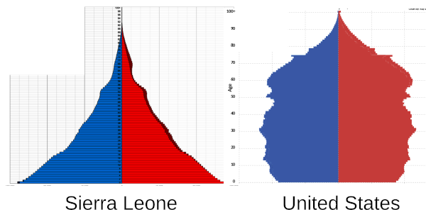

The African COVID paradox
===================================================

How would you like some good news about COVID, which is also good news about Africa?

*(International comparison of COVID death rates, cumulative through December 2022.
Source: https://www.economist.com/graphic-detail/coronavirus-excess-deaths-estimates - fair use)*

The map shows the current best estimates, country by country, of the number of people who
have died of COVID. If you're like me, you know people who have died during the epidemic,
and with elderly people, at least in some cases, it can be hard to know whether COVID was really the reason they died.
Maybe it was just
a contributing cause, or not the cause at all. And in many poor countries, there aren't
detailed and systematic death records. This map, made as an open-source project by *The Economist*,
sidesteps those issues by looking at the total number of deaths during the epidemic, and subtracting
the baseline of deaths that would have been expected based on data from before COVID hit.

The good news is that equatorial Africa has extremely low death rates from this virus.
The most extreme case is Sierra Leone, which is the little gray oval on the west coast.
You might think that the gray color was like the gray color of Greenland, a
blank marker to show that there's no data. No, it's real. The COVID death rate there seems
to be really, really low. (Well, this has been controversial. More on that below.)

That's good, but totally unexpected. For comparison, here's a map from before COVID of how badly different
regions of the world were generally afflicted with lower respiratory tract infections. The colors represent something
called a "disability-adjusted life year" (DALY), which is a way of measuring how many years of life people missed
out on because they died. (It also attempts to assign an equivalent if the disease didn't kill them but hurt their
quality of life). Check out the scale. Sierra Leone's suffering from these infections is more than *70 times*
what we experience where I live, in the US. This is partly because it's a poor country with a weak public
health system, and also partly because they experience more conditions such as malnutrition and poor housing,
which worsen people's health outcomes.

*(Source: //en.wikipedia.org/w/index.php?title=Lower_respiratory_tract_infection - CC-BY-SA)*

That makes it even more surprising that the COVID death rate is so low in places like Sierra Leone, and
in many quarters the initial reaction was to say that it just couldn't be true. The New York Times
ran an [article](https://www.nytimes.com/2022/03/23/health/covid-africa-deaths.html) on the topic in March 2022,
with a variety of African and overseas experts making contradictory statements, with some expressing
disbelief and others insisting that Africans wouldn't have been oblivious if people were dying in their communities.

One obvious thing to check is how much of the seeming African miracle could be explained simply because
the population in Africa, especially poor countries in equatorial Africa, skews very young.
The graphs above show a comparison of the population pyramids in Sierra Leone and US. The population
of the US is relatively static, and would even be shrinking if not for immigration. In Sierra Leone,
the population is growing rapidly, families tend to have many children, and not many people live beyond 70.
Since the risk of death from COVID rises exponentially with age, it makes sense that in a country with
a far smaller proportion of old people, the toll will be much less.

But the demographic effect probably isn't big enough to explain the entire disparity in death rates.
Another factor that comes into play is that empirically, infectious disease in poor countries shows a different
pattern in how it affects people of different ages, in comparison to rich countries.

*(Graph by the author.)*

These graphs show a comparison of the case fatality rates (CFR) in Italy and Kenya. A "case"
is anyone who gets recorded in official statistics as having COVID. Note that the y axis is
goes by factors of 10, so it takes the very drastic up-curving shape of the graphs and makes them flatter.
When this type of graph comes out looking like a line, it means that the true relationship is exponential,
i.e., for every decade of age, your risk gets multiplied by a certain factor.

The two curves have different exponential growth rates, which was surprising to me but is apparently
a well-known thing in epidemiology. In rich countries, younger people are affected less by disease,
but older people are affected more. For example, if a young person in Italy gets HIV, they will have
a better chance of getting treatment than the average person of the same age in Kenya. But as the trend
continues into the older age brackets, the situation gets reversed. Old people in Kenya will tend to
do *better* with disease than people their age in Italy. 
The fact that it applies to COVID, as shown in the sample graphs above, seems to be pretty well established (Demombynes 2022,
Chauvin 2020).
There is a lot of scientific work
currently being done to understand this, but the leading hypotheses have to do with the fact that
older people in developed countries are more likely to have unhealthy lifestyles.

*A lifestyle where physical activity isn't optional. - https://commons.wikimedia.org/wiki/File:Kenema-Kailahun_Road.jpg - CC-BY-SA*

A lot of attention has focused on physical activity as an explanation for the gentler age-dependence
of the COVID mortality curves (Wachira 2022). In general, people in a country like Sierra Leone are
very physically active, simply because it's required by the way they make a living and carry out their daily lives.
But this hypothesis is hard to test quantitatively as an explanation
for the African COVID paradox, because the relevant data in Africa come mostly from the most affluent sector of
the population in more developed countries. The best study involved South Africans who got an incentive
from their employer or their health insurance company to wear an electronic gadget such as a Fitbit or keep a log
of their exercise (Steenkamp 2022). And in any case, a sedentary
lifestyle is just one part of a set of intercorrelated health issues that includes also includes obesity and diabetes.

But rates of diabetes, at least, are relatively easy to obtain for various countries.
So the idea that occurred to me was to use diabetes as a stand-in
for this entire suite of lifestyle-related health problems. In rich countries, diabetes
rates are high, but the disease is usually managed well, so that not many people die as a direct effect of it.
In poor countries, the different lifestyle produces much lower rates of diabetes, but death rates are actually higher
because treatment is not widely available. For those reasons, it makes more sense to use rates of occurrence of diabetes
as a lifestyle indicator rather than rates of death from the condition.

*(Graph by the author, showing Kenya, Sierra Leone, South Africa, India, and the US.
Open-source data and code at [https://github.com/bcrowell/african_covid](https://github.com/bcrowell/african_covid).)*

The graph shows covid death rates plotted versus the rate of incidence of diabetes. 
In order to account for some confounding
factors, I've attempted to estimate the vulnerable population of each country. I define "vulnerable"
as someone who is age 65+ and has not received any doses of a COVID vaccine (and I assume these two fractions
multiply like independent probabilities). This is admittedly
very crude, but it allows us to approximately eliminate the possible confusion caused by the differing
demographic pyramids, as well as by the fact that some African countries have low vaccination rates.
I haven't tried to correct for the prevalence of COVID, because the data are all cumulative figures,
and by now (December 2022), a very high percentage of the world's entire population has had a COVID
infection.

The graph seems to show a pretty tight relationship, suggesting that the low toll of COVID in Africa
can be explained by a combination of two things: a younger population, and a healthier lifestyle.
One thing that this explanation does seem to handle well is the difference between equatorial Africa
and countries like South Africa and India. People who didn't believe the death rates in equatorial
Africa were really so low tended to point to those two countries, which had devastating numbers of
deaths. South Africa and India, they suggested, are just better at keeping records and tracking
COVID infections. But their explanation doesn't seem to work well in explaining why there are so
few excess deaths in equatorial Africa, which, in the method used by *The Economist*, doesn't
depend on the availability of COVID testing. And the graph shows that there does seem to be an explanation
for why India and South Africa would be so different from equatorial Africa: the prevalence of
healthy lifestyles [does seem to differ a lot, as measured by diabetes](https://github.com/bcrowell/african_covid/blob/master/international_comparison.txt).

It may be that we'll get more definitive information
in the future from statistically rigorous projects such as Sierra Leone's SL-SRS, in which workers visit a random
sample of villages and neighborhoods, but for the time being it does seem that the low death
rates in equatorial Africa are real -- and worth celebrating.

As an American, I would like to not just celebrate those facts but also learn and benefit from
them. We should certainly not discourage older people
from going outside and getting physical activity. A healthier lifestyle is just better for people's health and
longevity in general -- although when it comes to COVID specifically, vaccination is probably a lot more directly
effective and easier to change.

I did spend some time looking at county-by-county maps in the US and seeing if I could detect correlations:

* [COVID (Click on "deaths per 100,000 people.")](https://www.arcgis.com/apps/MapSeries/index.html?appid=ad46e587a9134fcdb43ff54c16f8c39b)

* [obesity and diabetes (Click on the thumbnail.)](https://www.arcgis.com/home/item.html?id=c09aee5d3fee41c489fdffec21cb270a)

* [vaccination (Scroll down.)](https://covid.cdc.gov/covid-data-tracker/#county-view?list_select_state=all_states%26list_select_county%3Dall_counties%26data-type%3DVaccinations%26metric%3DAdministered_Dose1_Pop_Pct&data-type=Vaccinations)

What I seemed to find was that the really strong predictor of death rates was simply vaccinations.
For example, south Texas has extremely high rates of obesity and diabetes, but it has a fairly low COVID
death rate because its vaccination rate is high. Wyoming, on the other hand, has extremely
low rates of obesity and diabetes, but a lot of COVID deaths, probably because its vaccination rate is low.
The effect of lifestyle is a smaller effect that really
only becomes evident when you factor out vaccination, as I did in my graph.

So at the level of the entire population, vaccination is what's really crucial. But that doesn't mean it's
not potentially decisive at the individual level to have a healthy lifestyle.

*Full disclosure: I'm a physicist, not a doctor or an epidemiologist. I think my analysis is more or less
in line with the current thinking on the subject, as described in the list of references below. The only
part that's at all original with me is the use of diabetes as a proxy for lifestyle. Professionals
have done fancier things to try to factor out effects such as age and vaccination in population studies.
I haven't seen any recent professional studies that attempt to do the type of international comparison
I've done here; what I've done is simple and amateurish and is offered as a way of visualizing and
understanding what seems to be going on in the current scientific literature.*

[Ben Crowell](http://lightandmatter.com/area4author.html), 2022 Dec. 13

[other blog posts](https://bcrowell.github.io/)

This post is CC-BY-SA licensed.

References
--------------------------

Chauvin, 2020 - https://www.econstor.eu/handle/10419/237451

Demombynes et al., Are COVID-19 age-mortality curves for 2020 flatter in developing countries? - https://pubmed.ncbi.nlm.nih.gov/36351719/

Steenkamp, 2022, https://bjsm.bmj.com/content/56/10/568

Wachira, 2022, "Why are COVID-19 effects less severe in Sub-Saharan Africa? Moving more and sitting less may be a primary reason" - https://www.sciencedirect.com/science/article/pii/S003306202200041X
