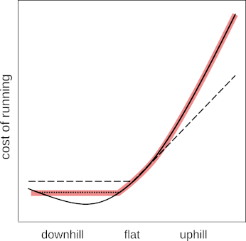

What's the climb factor of your run?
====================================

I love mountain trail running because it's simple and elemental. I don't need fancy gear,
and I'm directly tuned in to the natural world. Plus, how else are you going to get your
feet this dirty?

But there are good reasons to geek out about this sport when you're at home
on the couch. Here's a map of one of my favorite summer trail runs in the San
Jacinto Mountains. (If you want to see an actual usable map and description,
there's one [here on trailrunproject](https://www.trailrunproject.com/trail/7093426/san-jacinto-peak-loop).)
When I first envisioned this loop, I wasn't sure it was within my ability to do
safely by myself. It's not hard to work out the total mileage, and since the map
is a topo, you can also figure out how much elevation gain there is. Those are the two
numbers that people have traditionally looked at simply because they were easy to
get off of a paper map, and if you're curious what they are for this run, you can
seem them on the trailrunproject page, where they've been calculated by a computer.

The problem is that those numbers don't really tell you very much. The
total distance is helpful, but the science shows us that total
elevation gain isn't really a useful measure of energy
expenditure. It's a natural thing that laypeople wonder about. For
example, a reader of The Guardian [wrote in](https://www.theguardian.com/lifeandstyle/2022/aug/07/readers-reply-is-running-up-and-down-a-hill-better-for-you-than-running-on-the-flat) to the "Notes and Queries"
column to ask, "Is running up and down a hill better for you than
running on the flat? Or does the downhill bit being easier counteract
the uphill bit? What about running down a hill and then up, when
you’re already tired?" Well, the part about "better for you" is something
I don't really care about, because I run for enjoyment, but anyway the
underlying question is basically one about energy costs, which is the
same one I need to know about in my own example, to gauge whether my
endurance will be sufficient to get back to town.

I've written a [scientific
paper](https://www.biorxiv.org/content/10.1101/2021.04.03.438339v2) on
this topic, which may not be as entertaining as some of the cheeky
British humor in the Guardian column. The related code and data are
open source ([1](https://github.com/bcrowell/trail),
[2](https://github.com/bcrowell/kcals)). The TL;DR answer is that hill
climbing is a highly nonlinear effect. For
the relatively small slopes that most runners spend most of their time
running on, the uphills and downhills come very close to cancelling
out. However, on very steep mountain trails people aren’t efficient
enough at running downhill to make up for the climbing.

This graph summarizes the results. The black dashed line with the hockey stick shape
shows what you would think if you believed in total elevation gain as the right
figure to pay attention to; in that model, downhill is the same as flat. The
solid line is other people's previous lab work with elite mountain runners on
a tilting treadmill, breathing into a mask that measures their energy consumption.
The curve highlighted in pink is the result of my work, in which I tried to
find a model that would do a good job of rescribing real-world results from
races. The cost of running downhill is indeed lower than the cost of running
on the flats, but on very steep slopes the going is not as easy as you'd
think from world-class athletes on a treadmill. The near-cancellation of uphills
and downhills for less severe hills comes about because the middle portion of the pink graph is nearly
a straight line.

Of course you can get smartphone apps and wearable consumer gadgets like the fitbit et al. that
claim to tell you your energy consumption. The trouble is that these things use
algorithms that aren't public and probably not based on any valid science. And
a wearable device won't help you with planning for a future run.

It's unfortunate that the scientifically validated figures aren't as
easy to figure out in your head as the traditional mileage-and-gain
numbers, but I've written [an open-source web-based
app](https://lightandmatter.com/cf) (also usable off-line) that will
compute it for you if you upload a track. The track can be from
someone else who's hiked or run the route while carrying a GPS, or you
can generate it with an application such as google maps or
[onthegomap](https://onthegomap.com/). It will output a number that I
call the *climb factor* of the run (CF), which is defined as the percentage
of your energy used in hill-climbing, compared to a flat course. So for example,
if the CF is 50% for a 10 mile run, then the energy expenditure for the run
is equivalent to 20 miles. If you're thinking of attempting that run, then you
just need to check whether you normally have enough endurance to run twenty miles
on the flats.

Other applications:

- Set a target time and splits on a course you've never run.

- Compare trail races on an objective basis.

- Measure results from training.

[Ben Crowell](http://lightandmatter.com/area4author.html)

