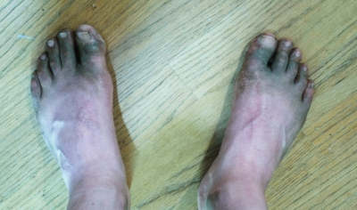
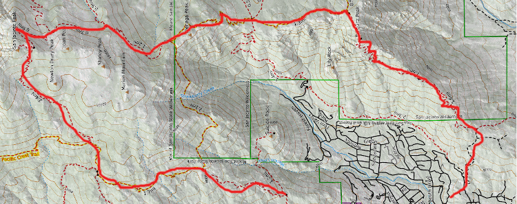

What's the climb factor of your run?
====================================

I love mountain trail running because it's simple and elemental. I don't need fancy gear,
and I'm directly tuned in to the natural world. Plus, how else are you going to get your
feet this dirty?

But there are good reasons to geek out about this sport when you're at home
on the couch. Here's a map of one of my favorite summer trail runs in the San
Jacinto Mountains. (If you want to see an actual usable map and description,
there's one [here](https://www.trailrunproject.com/trail/7093426/san-jacinto-peak-loop).)
When I first envisioned this loop, I wasn't sure it was within my ability to do
safely by myself. It's not hard to work out the total mileage, and since the map
is a topo, you can also figure out how much elevation gain there is.

