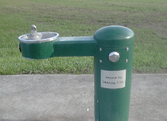

Myths and facts about water and thirst
===================================================

This article discusses some of the popular mythology surrounding hydration and 
drinking water from wilderness sources, from the point of view of hikers and trail runners.

Safe to drink!
https://commons.wikimedia.org/wiki/File:Lila_Lake_26527.JPG - CC-BY-SA

Myths about hydration
--------------------------

Our popular culture has picked up some pervasive myths recently that wildly exaggerate the dangers of dehydration.
There is a widespread belief that even if you're just sitting at a desk all day, you should drink at least
eight 8-ounce glasses of water per day ("8x8"). A survey of the medical literature shows no
evidence to support this claim.[Valtin 2002] In order to believe the 8x8 myth, you would have to believe
that your body was always lying to you about how much water you needed, hence the subsidiary myth that
"thirst is too late," i.e., that you need to drink when you're not thirsty, because by the time you're
thirsty, you're already dehydrated. In fact, thirst is one of your body's most powerful instincts.
Medically, dehydration is defined as a 5% increase in the concentration of solutes in your blood.
(Often this can be more conveniently detected based on short-term weight loss.) Thirst sets in at
about 2%, so you'll always feel strong thirst setting in long before you're dehydrated. It is also not true that
dark urine indicates dehydration.

Because of the "thirst is too late" myth, many hikers carry huge amounts of water -- sometimes as much
as several liters, often in a hydration pack. Hydration packs are heavy (about 9 oz for a large one),
and water is very heavy. Three liters of water in a 9-oz hydration pack adds up to 7.2 pounds of extra
pack weight, which is a vast amount of weight to be carrying based on a mistaken belief. In moderate summer
weather in the Sierra, on a trail where streams are no more than
a few miles apart, there is theoretically no reason to carry *any* water from point to point. In reality,
you'll want to carry some, for a variety of reasons. You may be treating your water with tablets that take
a certain amount of time to work; or camping at some distance from over-impacted areas near lakes and streams;
or in late season you may be uncertain whether the creeks and streams on your map are actually running.
Nevertheless, one liter per person is usually plenty of water to carry under these conditions, and you
can carry that in a couple of lightweight plastic water bottles of the type that bottled water is sold in.
This adds up to 2.3 lb immediately after refilling both bottles.

This disinformation about thirst is also affecting runners. Starting around 2012, I started seeing a lot
of runners on my city's public trail system wearing vests or Batman-style utility belts with water bottles
holstered in them. Carrying all that gear interferes with running, and it's totally unnecessary because
the trail system has water fountains. More recently the holsters and vests seem to have gone out of style,
but a lot of people are carrying water bottles in their hands, which is just as physically awkward when
you're trying to run.

https://commons.wikimedia.org/wiki/File:Bebedouro_para_cachorros_-_City_Park_New_Orleans.jpg - CC-BY-SA

### Myth: caffeine causes dehydration

Proponents of the dehydration myth commonly claim that alcoholic and caffeinated drinks "don't
count," because alcohol and caffeine dehydrate you. In fact, beer consumed in moderation has a hydrating,
rather than a dehydrating, effect,[Valtin 2002] and laboratory studies have shown that caffeinated soda
is just as hydrating as water, i.e., the diuretic effect of the caffeine is too small to measure.[Grandjean 2000]
Even in the case of coffee, which has much higher concentrations of caffeine than soda, studies going back
as far as 1928 have shown that the diuretic
effect vanishes for people whose bodies  have learned to tolerate the caffeine.[Eddy 1928]

### Myth: you should abstain from caffeine at high altitude

Because of this misplaced fear of a diuretic effect, one sometimes hears advice to abstain from
caffeine at high altitude, the reasoning apparently being that if caffeine had a diuretic effect,
it would dehydrate you, and dehydration would contribute to acute mountain sickness (AMS).
In fact, reviews of the effects of caffeine at high altitude [Hackett 2010], and specifically of
tea at Everest base camp [Scott 2004], showed that there were multiple positive effects of
caffeine and no detectable negative effects. The positive effects included a decrease in high-altitude
lassitude, as well as an improvement in athletic performance that was a bigger at high altitude
than at low altitude. Dehydration is difficult to avoid at very high altitudes such as
the altitude of Everest base camp; however, the Everest study showed that the hydration
status of tea drinkers was the same as that of a control group who abstained from caffeine.

Hackett writes: 
"While symptoms of dehydration are similar to AMS, no compelling evidence suggests that
dehydration contributes to AMS. [...]
Similar to caffeine's successful use for headaches at low altitude, owing to its cerebral
vasoconstriction properties, it is likely that caffeine will help prevent or treat
altitude headaches and therefore AMS [...]
[T]he symptoms [of caffeine withdrawal] and their timing (12 to 24 h) mimic acute
mountain sickness. [...] One can only guess at how many cases of caffeine withdrawal
are misdiagnosed as AMS and at what role caffeine withdrawal might play in promoting AMS."

Heat stroke
--------------------------

In contrast to dehydration, which people worry about too much, heat stroke is a condition that people
don't worry about enough. Here's an account of a typical situation where hikers died of
heat stroke. 

On July 18, 2009, Robert Allen Liebler and a hiking partner started at 3:45 a.m.
from the desert of Palm Springs, intending to summit San Jacinto Peak.
This classic hike, well known to locals, involves an elevation gain
of 10,000', and is normally undertaken only in fall or spring, not summer.

At 6 am, Liebler started cramping because of the heat and turned around, telling his partner to go ahead.
Liebler was found dead the next day.
He was off the trail, about 200 yards away from a tennis club, sitting upright, with water
still remaining in his bottle.

This story illustrates the insidious nature of heat stroke. Liebler
evidently didn't feel himself to be in distress, or he would have
drunk his water and wouldn't have sat down so close to rescue.  A
victim of heat stroke may collapse like turning off a light switch,
which is why it's common to find hikers dead from heat stroke when
help was nearby.  When heat stroke is coming on, the victim's brain
starts malfunctioning.  The fact that Liebler was found off the trail
suggests that he may have become confused and disoriented, or that his
judgment may have been impaired.  It is common for victims of heat
stroke to hallucinate or behave irrationally. 

Because Liebler didn't drink the water he had, it seems that carrying
large amounts of water would have done nothing to save his life. The
key to his death was his bad decision to hike in the hot weather of
Palm Springs that day: a high of 116 degrees Fahrenheit.  Although he
wisely started out long before dawn in order to avoid these
temperatures, they were caught in a situation where retreating down
the trail entailed descending into the heat in the middle of the day.
The moral of this story is that if you're considering hiking in a
low-elevation area where the temperature can get very high, you need
to check the weather forecast, and cancel your hike if the
temperatures are likely to be life-threatening. 

The medical evidence doesn't even support the idea that if you
*did* drink more water, it would reduce your risk of heat stroke.
Studies with endurance athletes in real-world conditions showed that
post-race body temperatures were not reduced by drinking more water
[Noakes 1988], and "there is not a single case report or clinical
trial that unambiguously links exercise-induced dehydration with
specific life-threatening, exercise-related disorders"
[Curran 2004].

Myths about contaminated water
--------------------------

A multi-day backpacking hike (what people in some countries call trekking or bushwalking)
involves a change in your diet and daily routine, which can disrupt bowel function. Many backpackers
get constipated,[Mueser 1997, p. 101] while others report "backpacker's diarrhea." 
Diarrhea hits about 10-20% of backpackers on short trips, more than 50% on long through-hikes.[Zell 1993,Mueser 1997]

### Myth: Backpackers have a significant risk of getting sick from *Giardia* in the water.

Many people who experience
diarrhea while backpacking automatically attribute the problem to *Giardia*, which is the most popularly known
microorganism that can contaminate backcountry water supplies. Among weekend backpackers,
it is almost certain that any illness during the hike itself was not caused by wilderness-acquired *Giardia*, which has a typical
incubation period of about a week or two.[Erlandsen 1984, Jokipii; see more detailed information in the footnotes]

*Giardia* is a big problem in daycare centers and public swimming pools, but recent
data show that its prevalence in the backcountry has been wildly exaggerated. In a surveys of sites in California's Sierra Nevada mountains,
concentrations of *Giardia* cysts were much too low to be a realistic health 
risk.[Suk 1986] Studies on prison volunteers
show that on the average, you have to swallow about 20 or 30 cysts to get an infection,[Cox 2002][Rose 1991]
and even at the most contaminated site
in the surveys, a hiker could only have swallowed this many of the
bugs by drinking hundreds of liters of water.
In fact, 67 out of the 69 sites in the survey
had concentrations lower than 0.03 per liter, which is the
typical concentration found in San Francisco and Los Angeles tap water.[Rockwell 2002,sfwater 2009]
Elsewhere in the U.S., similar testing[Jaret 2003] also failed to turn up any concentrations of cysts likely to
cause disease at any of the backcountry locations tested: 
West Beaver Creek, AZ; Merced River, CA; Chattooga River, NC;
Neversink River, NY; White Pine Lake, UT; Greenwater River, WA; and Renard Lake, WI.

Giardiasis is extremely common among the population of the U.S., with roughly
a third of toddlers having it,[Ish-Horowicz 1989] and about 3-7% of 
adults.[Auerbach 2012]
Most people who have giardiasis have no symptoms, and
there is even some evidence that children who are asymptomatic carriers are actually *healthier* than those who aren't infected at all.[Ish-Horowicz 1989]
Giardiasis cases peak in the summer, probably because people swim in public pools used
by diaper-age children.[Furness 2000]
Very few people who believe they contracted giardiasis from backcountry water ever get tested for it,
and of those who get tested, most have negative results. Even when the results are negative, doctors
often prescribe medication as a prophylactic. When the results are positive, the long incubation period
makes it more likely that the hiker picked up the bug somewhere else, perhaps by changing a diaper
or swimming in a public pool. 
A meta-analysis of the literature in 2000 concluded that "the evidence for an association between drinking
backcountry water and acquiring giardiasis is minimal."[Welch 2000] 

Obviously these can't be absolute statements of zero risk. For example, if you take your water from
a puddle with a big heap of mule poop in it, you're taking a risk. Picking your water sources is discussed later
in this article. I haven't seen any studies like Rockwell's for other mountains of the world
such as the Andes or Himalayas.

Because the only common and well documented way that humans get sick with giardiasis is by catching it
from other humans, it's not surprising that the only places epidemiologists have managed to detect
disease-causing concentrations of giardia in water have been in the water supplies of cities, towns, and
farms -- not uninhabited backcountry areas. A 1977 epidemiological study[Juranek 1977] of giardia outbreaks in
Rome, NY; Camas, WA; and Berlin, NH found no strong evidence that the water supply was naturally
contaminated. The outbreak in
Berlin, HW, was initially blamed on beavers that built a dam in the town's reservoir, which is
fed from the White Mountain National Forest.[Lippy 1977] However, there was "ample opportunity for
human fecal contamination of raw water sources," and although giardia was found in a captured beaver,
the beaver may have actually caught the disease from the human population.[Juranek 1977]
In Camas, WA, it is unknown whether the giardia in the water supply came from humans or beavers.
Another protozoan cyst, *Cryptosporidium*, has been studied in farming areas of Switzerland, and although
the concentrations were  high enough that they might theoretically cause disease,[Fuechslin 2012] 
again there seems to be evidence only that disease-causing protozoa in water supplies originate from
humans in inhabited areas.

### Wash your hands!

When people do actually contract backpacker's diarrhea from exposure during a hiking trip, by far the
most common reason is hand-to-mouth contamination.[Welch 1995] Your gut contains so many bacteria that if your
body was a democracy, the germs would outvote the human cells by a large margin. You've developed tolerance
for your own gut flora, but not for other people's. If your hiking partner doesn't wash his/her hands
properly after pooping, then you can ingest their bugs through shared food, food containers, or pots
and pans. Hiking groups are extremely prone to contaminating each other with organisms such as
*E. coli* and *shigella*. To guard against this, don't lower your standards of poop hygiene while hiking. 
(Don't rinse
your hands in a stream, because the soap is environmentally damaging. Do your hand-washing in the same
area where you do your pooping, i.e., as far as possible from lakes and streams.) If possible,
avoid using cooking pots -- either by by going no-cook or by using foods that are cooked by pouring hot water into
an individual-use bag. If you must use pots, wash them thoroughly after each use, and
consider using a one-pot system, in which each person eats only from his/her own pot. 

### Water treatment

If you do decide that treating your water is worthwhile in a certain area, then
tablets will save you about 5 ounces of pack weight compared to most filtering
systems, and are less time consuming to use.
But don't let water treatment distract you from the real issue, which is hand-to-mouth contamination;
a 1997 study found that among a large sample Appalachian Trail through-hikers,
a majority of whom experienced diarrhea at least once, there was no correlation between the use of
water treatment and the risk of diarrhea.[Mueser 1997] A 2013-2014 survey of long-distance hikers
on the PCT and AT had similar findings.[Feldman 2015]

Water treatment works differently for bacteria and viruses than for cysts of the protozoa *Giardia* and
*Cryptosporidium*. Iodine doesn't work well against protozoans, but filters do, and chlorine
dioxide tablets are effective if you wait long enough (up to four hours for very cold water). 
One low-weight, low-cost system is to use iodine to kill bacteria and
viruses, plus a small 2-oz filter that fits on the mouth of the bottle to get rid of protozoa cysts.
But remember, getting sick from *Giardia* in your water is little more than an urban folktale,
and field surveys show that concentrations of *Cryptosporidium* are also much too low to be
a health threat.[Jaret 2003] Since the techniques that work against protozoans all have drawbacks (inconvenience
or higher cost), it may not be worth worrying about them. A survey of Appalachian Trail through-hikers
showed that filters were one of the most failure-prone pieces of equipment, leading to comments such
as "not worth the money or the effort."[Mueser 1997, p. 95]

The Steripen UV system is effective against all microbes, including viruses and protozoa cysts.
It's worse than chemical treatments in terms of bulk and weight (3.6 oz with batteries), but it works
in only a couple of minutes. The batteries will last for more days than you can hike without
resupplying. There is an initial investment of about $90, and the lamp has a finite lifetime. It's definitely worth considering for day-hikes,
for traveling in the third world, or for hikes in areas where protozoan-contaminated water is a big enough risk to be
worth worrying about. Among backpackers on long through-hikes, there is anecdotal evidence that it is unreliable,
but the reliability of more recent models is reputed to have been improved by a redesign that replaced electrodes
with an optical sensor.

### Myth: When you treat water by boiling, you have to boil for a certain number of minutes.

If you're boiling water for use in cooking, then the water is already pasteurized before it reaches
the boiling point. It is not necessary to use filtering or chemical treatment, and iodine treatment
may even cause foods like instant mashed potatoes to turn a funny color. It is not necessary to boil
for a certain amount of time in order to kill microorganisms. Protozoa cysts are killed rapidly at
about 55 C (131 F). Common bacteria and viruses such as *E. coli*, *Shigella*, and Hepatitis A are all
killed rapidly at temperatures at or below 65 C (149 F).
Even raw milk (which can be swarming with microbes compared
to backcountry water) is normally pasteurized for only 15 seconds at temperatures of no more than 72 C (161 F), based
on standards designed to kill the most heat-resistant disease-causing bacteria.[USDA 2004]
Although the boiling point is depressed at higher altitudes, even at the 17,000-foot elevation of Everest base camp
it's  82 C (180 F), which is high enough for complete pasteurization.

It's true that certain microorganisms can survive being boiled for a short time and still cause disease in humans.
These are bacterial spores from the genera *Bacillus* and *Clostridium*. Examples of the diseases they
cause are anthrax, tetanus, and botulism. However, these diseases are not transmitted by ingestion of the spores
in drinking water, so they're not a concern here.[Ericsson 2002] For example, when people get botulism, it's because they ingest
the growing organism, which has been proliferating in food; you don't get botulism by ingesting the dormant
spores. 

### Picking a source

It is worthwhile to take your water from the cleanest possible place. The best source is
a fast-running stream that is not below any trail or close to any area where you see droppings
from livestock. (Calves, in particular, excrete a huge amount of cryptosporidium compared to
wild animals or adult cows. Cattle are also prolific sources of E. coli.) Inlets of lakes are
better than outlets, and outlets are better than the calm water of the lake itself.
If you must collect calm water from a lake, avoid areas
that seem like likely swimming spots for humans, or areas around beaver dams (beavers tend
to carry a lot of giardia).

If you're forced to take water from a lake, I've heard conflicting statements about whether
the safest water is at the surface or deeper down. I've seen some statements that the surface
layer is the likeliest to harbor nasty bugs, so you should
avoid the surface layer by covering the mouth of
the bottle and plunging it in to arm's depth before letting any water in. 
I've also seen statements that the top layer of water is sanitized by solar UV, so it's
the safest. I would be grateful if anyone could point me to a scientific paper that
would clarify this point.

If you are forced to drink from a source that isn't running rapidly, be aware that blue-green
algae can produce toxins that can make you sick. Treatment will not get rid of the toxins. Even after
an algae bloom has died off, the toxins can remain in the water if it's stagnant. The only way to
avoid this problem is to plan your hikes so that you never have to drink from such sources.

### Drink mixes, "energy drinks," and electrolyte supplements

Some hikers add drink mixes to some of their water.
This adds variety to the monotonous diet of a long hike, and for people who can taste iodine, the mix masks the taste.
Mixes can be either zero-calorie (e.g., Crystal Light) or sweetened with sugar (e.g., Kool-Aid). If you use the ones sweetened with sugar,
be scrupulous about cleaning the threads of your water bottles, because otherwise you may risk dysentery.[Mueser 1997, p. 100]
If you're using chemical treatment, wait until it's complete before adding the mix.

So-called "energy drinks" are a marketing phenomenon with little scientific justification. They're
expensive, and they come in single-use plastic bottles, which are a huge environmental problem.
People used to think that muscle cramps were caused by the loss of sodium from the body during
intense endurance activity, which gave a reason for using these drinks to maintain one's electrolyte
balance. However, studies show that's not true, and cramps really just occur because the nerves in
the muscles have been repeatedly stimulated. The same marketers have also pushed the idea that
you need to "fuel" your exercise by constantly consuming sugary drinks or gels. Typically it takes
quite a long time for your body to digest your food and turn it into muscle and liver glycogen,
which are the main source of energy for endurance activity. If you're going on a morning run, your
source of energy is glycogen from last night's dinner. Hunger doesn't mean you're going to "bonk,"
and you can bonk (run out of glycogen) without being hungry. If you think you might get hungry
during a 15-mile run, bring some oreos in your pocket, and eat them if you feel hungry. (Marathon
distances are a little different, and it can make sense to drink sugary drinks at that distance
for the sake of their relatively rapidly digestible carbs.)

[Ben Crowell](http://lightandmatter.com/area4author.html), 2022 Nov. 29

[other blog posts](https://bcrowell.github.io/)

References
--------------------------

Auerbach 2012 - Paul S. Auerbach, Wilderness Medicine (6th ed., 2012), ch. 68

Cox 2002 - Cox, F.E.G. (2002). History of Human Parasitology. Clin. Microbiol. Rev. 15(4): 595, referencing a 1954 study by Rendtorff. Rendtorff's data are summarized and analyzed in Rose 1991.

Curran 2004 - Curran, Rob, "Marathon Maladies & Dehydration Debunked," EMS World, June 2004, 
https://www.emsworld.com/article/10324701/marathon-maladies-dehydration-debunked , citing
Noakes TD, "Hyponatremia in distance athletes," The Physician and Sportsmedicine 28(9):71, Sept. 2000.

Eddy 1928 - Eddy NB, Downs AW. Tolerance and cross-tolerance in the human subject to the diuretic effect of caffeine, theobromine and theophylline. J Pharmacol Exp Ther. 1928;33:167-174.

Ericsson 2002 - Ericsson and Steffen. Water Disinfection for International and Wilderness Travelers.
    Clin Infect Dis. (2002) 34 (3): 355-364. doi: 10.1086/324747,
    http://cid.oxfordjournals.org/content/34/3/355.full

Erlandsen 1984 - Erlandsen, Giardia and giardiasis: biology, pathogenesis, and epidemiology, 1984. 
When an animal is infected
by a parasite, there's a prepatent period, which is the time from infection with a parasite to when the bugs reach
a life stage where they can be detected by a lab test. There's also an incubation period, which is the time from infection
to symptoms. For most parasites, the prepatent period is shorter than the incubation period, but for Giardia it's
often longer. A 1954 study on prison volunteers showed an average prepatent period of 9 days, but there's
a wide range of variation, and the incubation period can be as long as months. In a study of travelers to the Soviet Union,
the typical time until acute symptoms occurred was found to be a couple of weeks.

Feldman 2015 - Dan Feldman, "Is Water Treatment Necessary?," http://distancehiking.com/tools/watertreatment/

Fuechslin 2012 - "Cryptosporidium spp. in drinking water: Samples from rural sites in Switzerland,"
        Swiss Med Wkly. 2012;142:w13683, http://www.smw.ch/content/smw-2012-13683/

Furness 2000 - Furness, Beach, and Roberts, "Giardiasis surveillance--United States, 1992-1997," MMWR CDC Surveill Summ. 2000 Aug 11;49(7):1-13.

Grandjean 2000 - Grandjean et al., "The Effect of Caffeinated, Non-Caffeinated, Caloric and Non-Caloric Beverages on Hydration," Journal of the American College of Nutrition, Vol. 19, No. 5, 591-600 (2000)
http://www.jacn.org/cgi/content/full/19/5/591

Hackett 2010 - Hackett, "Caffeine at high altitude: java at base camp," High Altitude Medicine and Biology 11 (2010) 1.

Ish-Horowicz 1989 - Ish-Horowicz et al., "Asymptomatic giardiasis in children," Pediatr Infect Dis J. 1989 Nov;8(11):773-9.

Jaret 2003 - Peter Jaret, "What's In the Water?," Backpacker, Dec. 2003, p. 45.

Jokipii, The Lancet, Volume 309:1095.
In about two thirds of patients, the prepatency period was longer than the incubation period by a week or more.

Juranek 1977 - D. Juranek, Waterborne giardiasis,
            in Waterborne Transmission of Giardiasis: Proceedings of a Symposium, September 18-20, 1978,
            eds Jakubowski and Hoff

Mueser 1997 - Roland Mueser, <b>Long-Distance Hiking: Lessons from the Appalachian Trail</b>, International Marine/Ragged Mountain Press, 1st edition, 1997, p. 96

Noakes 1988 - Noakes et al., "The danger of an inadequate water intake during prolonged exercise," European Journal of Applied Physiology and Occupational Physiology 57 (1988) 210.

Rockwell 2002 - Robert L. Rockwell, 
Sierra Nature Notes, Volume 2, January 2002, http://web.archive.org/web/20051026030831/www.yosemite.org/naturenotes/Giardia.htm

Rose 1991 - Rose, Haas, and Regli,
             "Risk assessment and control of waterborne Giardiasis,"
             Am J Public Health 81 (1991) 709,
             http://www.ncbi.nlm.nih.gov/pmc/articles/PMC1405147/pdf/amjph00206-0039.pdf

Scott 2004 - Scott et al, "The effect of drinking tea at high altitude on hydration status and mood," Eur. J. Appl. Physiol. 91(4):498.493

sfwater 2009 - http://sfwater.org/Files/FactSheets/2009-WQB_annualreport_LowRes.pdf

Suk 1986 - Map cited as reference 17 in
     S.C. Zell, "Epidemiology of wilderness-acquired diarrhea: implications for prevention and treatment,"
     Wilderness and Environmental Medicine 3 (1992) 241,
     http://www.wemjournal.org/article/S0953-9859(92)71235-2/abstract

 
USDA 2004 - National Advisory Committee on Microbiological Criteria for Foods:
Requisite Scientific Parameters for
Establishing the Equivalence of
Alternative Methods of Pasteurization,
USDA , 2004

Valtin 2002 - Heinz Valtin, "'Drink at least eight glasses of water a day.' Really? Is there scientific evidence for '8x8'?," Am J Physiol Regul Integr Comp Physiol 283: R993-R1004, 2002. http://ajpregu.physiology.org/cgi/content/full/283/5/R993

Welch 1995 - Thomas R. Welch and Timothy P. Welch, "Giardiasis as a threat to backpackers in the United States: a survey of state health departments,"
Wilderness and Environmental Medicine, 6 (1995) 162, http://www.wemjournal.org/article/S1080-6032%2895%2971046-8/abstract

Welch 2000 - Welch, T.P. "Risk of giardiasis from consumption of wilderness water in North America: a systematic review of epidemiologic data," Int J Infect Dis. 2000;4:103100, http://download.journals.elsevierhealth.com/pdfs/journals/1201-9712/PIIS1201971200901024.pdf?refuid=S1080-6032(04)70498-6&refissn=1080-6032&mis=.pdf

          
Zell 1993 - S.C. Zell and S.K. Sorenson, "Cyst acquisition rate for *Giardia lamblia*  in backcountry travelers to Desolation Wilderness, Lake Tahoe,"
Wilderness and Environmental Medicine 4 (1993) 147, http://www.journals.elsevierhealth.com/periodicals/jwm/article/S0953-9859%2893%2971172-9/abstract
       
