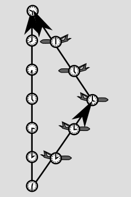

Why can't you go faster than the speed of light? -- An explanation without equations or fallacies.
===================================================

It's easy to find explanations online of why you can't go faster than the speed of light. What's harder
to find is an explanation that isn't over-simplified to the point of fallacy. I've done
[a previous blog post](https://bcrowell.github.io/moving_through_spacetime_at_c/) debunking one
family of these pseudo-explanations. (If you read that article, then you'll see that I've recycled
a few diagrams and a bit of text here.)

*The KATRIN spectrometer being transported. (See text near the end of this article.)
A possible, but unlikely, result of the experiment would be to show that a certain kind of
neutrino goes faster than light. (Wikimedia Commons user Dkw, CC-BY-SA license. https://commons.wikimedia.org/wiki/File:Ortsdurchfahrt-Leopoldshafen.jpg)*

It's also easy to find explanations that labor through a lot of algebra to arrive at this
type of result, without any of the dumb non sequiturs. Almost any pre-internet writeup
fits in this category. A perfectly serviceable example is Einstein's own book-length popularization from 1916,
[Relativity, the special and general theory: A popular exposition](https://www.gutenberg.org/ebooks/5001).

In this blog post, I aim to give a no-swindle explanation that explores all the logical ins and outs, but
with no equations, only graphs and diagrams. Yes, believe it or not, this type of topic can be discussed
in a completely rigorous way without equations. Because I'm only focusing on the single topic of faster-than-light
motion, my article can be fairly short.

My general take on the topic is that current physical theories don't so much *forbid* faster-than-light
motion as *defend* against it, with a multi-layered defense system that, while worthy of any James Bond
villain's secret island fortress, is not necessarily impregnable. There actually isn't any one reason that is
"the" reason you can't go faster than the speed of light, and in fact a  good way of detecting
bogus presentations is that they make it sound as if there is a single one. Another way you can tell
a low-quality explanation is that they try to make it sound as if the result just logically has to be
that way, without any input from observations or experiments, such as the one pictured above.

To avoid repeating myself in lots of different blog posts about relativity, I've made a 
[separate post](../spacetime_diagrams) that gets us off the ground by explaining a few basic
ideas: spacetime, spacetime diagrams, world-lines, the relativity of time, and proper time.

Measuring a spacetime vector
----------------------------

As described in the previous post about spacetime diagrams, experiments show that time isn't absolute. However,
it doesn't depend on all kinds of random factors. If a clock moves smoothly through spacetime, then the time elapsed on the clock
depends only on the displacement vector, and not on anything else. This gives us a way of defining a measurement
of the "length" of the vector. 

But watch out, because these "lengths" don't have to behave in all the same
ways as lengths of arrows on a piece of paper. The figure below is a simplified spacetime diagram of the Hafele-Keating
experiment, with the plane simply traveling straight away from home base and then coming back at the same speed.

If you thought that ruler distances on paper were valid indications of clock time, then you would expect the
traveling clock to record more time than the home-base one. But remember, it's always the clock that *doesn't*
undergo anything but smooth motion that experiences the most time. That is, it's the other way around compared
to what you'd think from the lengths on the page. If it helps your intuition, you can
think of the line segments as roads, and the clock times as indications of how many gas stations
you pass on those roads. In this particular diagram, the longer road just happens to have fewer gas stations.
In this blog post, I'll present just enough information about the rules for "how many gas stations" there are in order
to make a logically rigorous framework for getting at my main topic, which is why relativity forbids faster-than-light motion.

Because a spacetime displacement vector extends across both time and space, what we have here is a measurement
system that is somehow a unified system of measurement for both time and space. Physicists call it "the metric,"
and it's basically nothing more than a set of "how-many-gas-stations" rules. In school you learned about the
Pythagorean theorem (sometimes referred to in textbooks as "the distance formula"), which is one way of characterizing
the metric of Euclid's conception of space. The metric of relativity folds this together with time measurement to make
a metric for 3+1-dimensional spacetime. One consequence of this is that in relativity, we have a natural system
of units in which the same units are used for both time and space. (This is similar to other cases in the physics where
units had to be unified and reconciled. For instance, the calorie and the kilowatt-hour are both units of energy, but
people didn't realize that at first; the fact that we use different units for food-energy and lightbulb-energy is
just a historical inconvenience.) In these natural units, when you compute speed by dividing distance by time,
the units cancel out. That is, velocity is a unitless thing. That means there is some special velocity that equals 1.
This is the speed that, as it turns out, light travels at, but relativists actually think of it as more of
a conversion factor between time and space units, and they prefer to work in a system of units where the conversion
factor simply equals 1. One such system of units would be the one where we use years to measure time, and light-years for distance.

By the way, although the mathematical details are not really our topic here, it's common that we will want to talk
about the *square* of the elapsed clock time along a certain vector, which is called the "interval," I. For example,
if a clock moves smoothly, along a certain vector, and its elapsed time is 3 years, then we would measure the
vector by its interval I=9 (in units of years-squared!). This turns out to be more convenient basically because
our system of space-time measurement has to be backward-compatible somehow with ruler measurements in space,
and those have to obey the Pythagorean theorem, which has squares in it.

What gives a vector its sense of individuality
----------------------------------------------

The figure shows two photos of a pen on a desktop. Are the pens pointing in the same direction?

You can probably tell that this is a trick question, because the desktop has a wood grain to it,
and the wood is oriented differently in the two images. In fact, these are two copies of the same
photo, just rotated a little.

This example shows that it can be a little tricky to define whether two vectors are "really"
the same. Vectors that look different could actually be the same vector, just seen by observers
whose frames of reference are rotated or in motion relative to one another.

One thing we can absolutely say for sure is that if the two vectors don't have the same measure, then
they aren't the same. If I'd shown you a short pen and a long pen, there wouldn't have been any doubt.

The converse is also true: if two vectors have the same measure, then we can always turn one into the
other by some change in our frame of reference. For spacetime vectors in 3+1 dimensions, this may require
some combination of a rotation and a change in your state of motion. (It may also require an additional
flip of the vector so that a future-directed arrowhead becomes one that points toward the past. For now, let's
not worry about that possibility, which is not something that you can do without being Benjamin Button.)
Two such vectors, which have the same interval, can be considered equivalent.

What makes time different from space
------------------------------------

When I was a kid, my pot-smoking relatives told me that time was "the fourth dimension." Groovy, man.
But we know that this isn't exactly true, because time doesn't behave like space. For example, we can
freely choose to move around in space, but not in time. This is why physicists talk about spacetime as
having 3+1 dimenions rather than 4. 

To see more precisely how this plays out in relativity, consider the experiment shown in the figure. The
scientist's spacetime displacement vector goes from A to C. The diagram is drawn the way she would draw
it in her own frame of reference: she is at rest the whole time, so the arrow points straight up.
At A she sends out a space probe to the right at a certain speed relative to her. It's programmed to cruise for a certain
time, then, at event D, turn around and blast its rocket engines so that it comes back at the same speed (again relative to her). It arrives back
at event C. The scientist measures the time from A to C, so retrospectively she can identify the event B that was
at the mid-point. Based on this experiment, she can say that events B and D were simultaneous. (This procedure is referred to
as Einstein synchronization of events B and D.)

So according to this observer, her own vector is purely in the time direction, while a vector from B to D, →, would be purely spatial.

We can't say that B and D are simultaneous in any *absolute* sense. An observer in a different state of motion would say that they weren't.
But to her, they are. The fact that they are simultaneous *to her* can be summarized as a fact about the relationship
between her own vector, which looks like this ↑,
and the B-D vector, which looks like this →. They look perpendicular when drawn this way, in this frame, so we say that they're
"orthogonal." When we have a metric (her ability to have a clock), we get this kind of definition of orthogonality for free.
But the rules of orthogonality, like the rules of length-measurement for vectors, are not the ones we would guess from the representation of
the arrows on a piece of paper. We can't always infer whether vectors are orthogonal based on whether they form a 90-degree
angle when we draw them. We simply *say* that they're orthogonal if they test out as orthogonal in this type of experiment.

Now suppose we have two of these orthogonal vectors, like  → and ↑, and we compare their intervals. For the timey one,
this is the square of the clock time along it. For the spacey one, it's not at all obvious that we can even define any
measure. We can't send a clock along it, because that would require the clock to travel at infinite speed, or teleport
(at least in the scientist's frame of reference).
But let's suppose that the metric can be extended in some nice way to include this type of vector, and see what conclusions
we can reach.

The intervals can't be the same, because then the two vectors would be equivalent, but time and space aren't the same,
so we don't expect there to be a way to interchange their roles just by spinning around or changing our state of motion.

Nor can either interval be zero, because then we wouldn't have a unified system of measurement that gave useful results
for both time and space.

The two intervals can't have the same sign, because then we could stretch vector to match its interval to the other's, and then they'd
have the same interval, which we've already ruled out.

Therefore the two intervals must have opposite signs. We've picked the convention that timey vectors have positive intervals,
so we'll assign negative intervals to spacey ones. A meter stick's spacetime vector is minus the square of its length, in the
appropriate units (such as light-years).

We're now all set to discuss the multiple impediments that relativity places in the way of would-be faster-than-light astronauts.

Defense number 1, kinematics
----------------------------

If we draw the vector ↑ and then start drawing all the possibilities in between that and →, we will eventually have to
transition from positive intervals to negative ones. At the transition point, we'll have a vector whose interval is
zero. Conventionally, we draw our diagrams so that the scales are properly matched on the time and space axes, and
then the zero interval is what occurs when the vector's representation on paper is at an angle of 45 degrees.
This amount of tilt is the speed that we call c, and c also happens to be the speed of light.

If we fix our attention on one event, and consider other events in spacetime according to their displacements from it, then
we get a picture like the one shown below. Spacetime gets divided up into three portions, with the boundaries defined by
a double cone. This three-way division is different from the Newtonian two-way setup where there is only the past and the
future.

Now suppose that an object starts at rest. Say it's a proton. For any period when it's at rest,
its spacetime displacement is a straight-up arrow. Next we speed it up a little (which is what actually happens
to a proton inside a particle accelerator). Now that it's in this new state of motion, any period of its
track through spacetime will be an arrow that tilts (let's say to the right). We accelerate it some more, and
it tilts some more. But of course, we could always change our frame of reference so that we've caught up with
Mr. Proton and are cruising alongside of him. That is, any of these vectors is equivalent to a straight-up
vector in some frame of reference.

What can never happen is that any of these vectors has a zero or negative interval, because then it wouldn't
be equivalent to a straight-up vector in any frame. Therefore as we accelerate the proton, the arrows can only
tilt closer and closer to the 45-degree line (the light cone), without ever reaching it.

This is the first way in which relativity thwarts our faster-than-light plans: no object can be boosted
past the speed of light by any continuous process of acceleration.

This may seem wrong, because it would seem that we could keep on adding one mile per hour to our
speed, then another mile per hour, and so on, and eventually we would surpass c.
Einstein later recalled that when he was trying to create special relativity, he got stuck on
this point for about a year. Finally he realized that "Time cannot be absolutely defined, and there is
an inseparable relation between time and [...] velocity." Therefore it didn't need to be true that
velocities add the way we normally assume. After this he finished his seminal paper
on special relativity within five weeks.

This is supposed to be a presentation without equations,
but as a side note for those who want to see a more concrete example, the combination of velocities u and v turns out to be (u+v)/(1+uv). So for
example, if you're going at a speed u=0.6 (60% of the speed of light), and you shoot a bullet from a gun at v=0.6 relative to you,
the bullet's velocity is only about 88% of the speed of light, not 120%. It's only at low velocities that the product uv occurring in this
formula becomes small compared to 1, in which case the final result is well approximated by u+v.

Defense number 2, causality
---------------------------

The first defense only tells us that we're not going to be able to get past c by steadily pouring on more and more steam.
But that doesn't rule out the kind of scenario like the discontinuous "jump to hyperspace" in Star Wars.

*(Painting by Wikimedia Commons user Alorin, CC-BY-SA licensed. https://commons.wikimedia.org/wiki/File:Warp_drive_starship.png)*

But nobody has ever found a way to do such a jump, and relativity gives us a separate, specific reason to believe that it isn't
possible. Suppose that we have a spacey vector, →. To an observer in a certain state of motion, this is a simultaneity vector.
But to observers who are moving to the left or right, this is *not* a simultaneity vector. To them, it will tip a little
bit so that it points somewhat into the past or future. In fact, any faster-than-light displacement vector has a negative
interval, so it's equivalent to any other vector with a negative interval, including many that represent motion back into the past.
This means that any mechanism for faster-than-light travel, communication, or transmission of energy is also a mechanism for
traveling into the past, sending messages back to the past, or transmitting energy back to the past.

These possibilities make physicists queasy, because they lead to time-travel paradoxes. For example, I could go back in time and
murder my own grandfather before he met my grandmother. Well, who knows, maybe cause and effect in our universe don't have to work
the way we mere mortals envision them. But if so, we've never seen any evidence of it.

Defense number 3, dynamics
--------------------------

An object has a vector called a momentum vector. In relativity, the momentum vector measures how hard an object's impact will
be if it hits something. It also measures its energy, such as the energy in a firecracker or an atomic bomb. It turns out that
in relativity, mass and energy are equivalent (the famous E=mc^2), so even a stationary, inert rock has a stupendous amount
of energy ("mass-energy"), and this too is incorporated into its momentum vector.

Incorporated in what way? Well, there is only one sensible direction for the momentum vector to point, and that's parallel
to the object's spacetime displacement vector. (To see this through a more formal argument, suppose, to the contrary, that the
momentum and the displacement were *not* parallel. Then in a frame where the object was at rest, its displacement vector would
be straight "up" on the page, but its momentum vector would tilt one way or the other. Which way? Right? Why right? Why not left?
This would violate the inherent symmetry of space, but a variety of extremely precise
experiments have failed to show any evidence of any such asymmetry in the laws of physics.)

The metric is a machine that takes vectors and give back the corresponding interval as a measure of the input vector.
If we put in a displacement vector, we get back an interval. If we put in a momentum vector, we get back a number that
is interpreted as the square of the object's mass. Therefore if we take a material object, whose mass is a positive, nonzero
number, then no matter how we accelerate the object, its momentum vector will
always have the same measure. Its mass always stays the same. (There is an old-fashioned way of
rewriting all the equations and redoing all the terminology so that the mass varies. Professional relativists haven't
used that set of conventions since around 1950, and it's finally dying out even in popularizations.)
This means that its displacement vector, which points in the same direction, will also have
a positive measure, and its speed will be less than c.

Light has no mass, so now we can see why light travels at c. Its momentum vector has a metric measure of zero, so its
displacement vector also always has zero measure, which indicates motion at c.

So we have a third and qualitatively different defense against
faster-than-light motion. If anything *can* go faster than c, it can't
be normal matter. It would have to be some other, exotic form of
matter whose mass-squared was *negative*. In other words, its mass
would have to be an imaginary number. That's not to say that we can
rule out such a possibility just because an imaginary mass seems
weird. Maybe exotic particles of this type exist. We've reserved a
label for them if the ever turn up -- they're to be called "tachyons,"
from the Greek word for "fast." Tachyons have been searched for as
products of radioactive decay (Alvager and Erman, 1965; Baltay et al.,
1970) and in cosmic ray showers (Clay, 1988), but none were found.
Some excitement was occasioned in a 2011 debacle when the
particle-physics experiment OPERA mistakenly reported
faster-than-light propagation of neutrinos; the anomaly was later
found to be the result of a loose connection on a fiber-optic cable
plus a miscalibrated oscillator. An experiment called KATRIN, pictured at the top of this article, is currently
measuring the mass of a certain type of neutrino, and in fact the way the
experiment works is that what it really measures is the mass-squared. So
if this type of neutrino has a negative mass-squared, and it's not too close
to zero, KATRIN may be able to tell that, and therefore prove that type
of neutrino to be tachyonic. Nevertheless, I don't think any physicists
want to bet a six-pack that this is how it will actually come out.

So, for example, we could imagine a device similar to the Star Trek
transporter, and it *could* teleport you faster than c, but only if the
beam that it transmitted was made of tachyons -- which we currently have
no evidence for the existence of.

[Ben Crowell](http://lightandmatter.com/area4author.html), 2022 Dec. 31

[other blog posts](https://bcrowell.github.io/)

This post is CC-BY-SA licensed.

