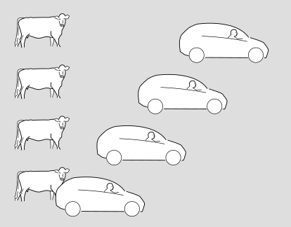
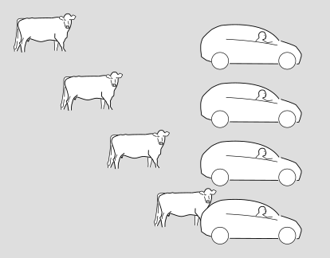
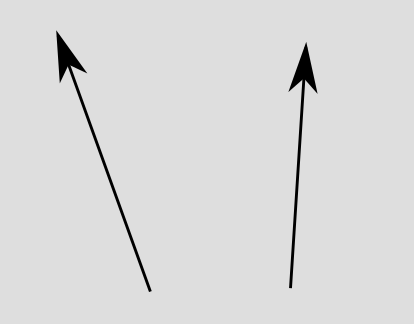
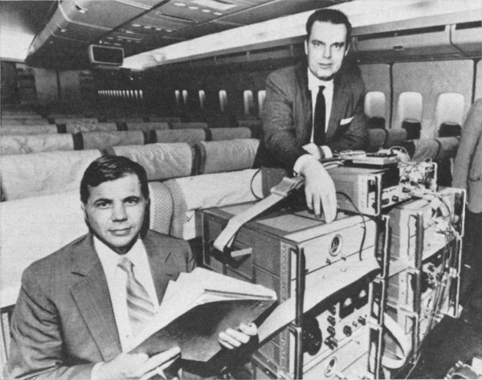

Why can't you go faster than the speed of light? -- An explanation without equations or fallacies.
===================================================

It's easy to find explanations online of why you can't go faster than the speed of light. What's harder
to find is an explanation that isn't over-simplified to the point of fallacy. I've done
[a previous blog post](https://bcrowell.github.io/moving_through_spacetime_at_c/) debunking one
family of these pseudo-explanations.

It's also easy to find explanations that labor through a lot of algebra to arrive at this
type of result, without any of the dumb non sequiturs. Almost any pre-internet writeup
fits in this category. A perfectly serviceable example is Einstein's own century-old popularization,
[Relativity, the special and general theory: A popular exposition](https://www.gutenberg.org/ebooks/5001).

In this blog post, I aim to give a no-swindle explanation that explores all the logical ins and outs, but
with no equations, only graphs and diagrams. Yes, believe it or not, this type of topic can be discussed
in a completely rigorous way without equations.

My general take on the topic is that current physical theories don't so much *forbid* faster-than-light
motion as *defend* against it, with a multi-layered defense system that, while worthy of any James Bond
villain's secret island fortress, is not necessarily impregnable. There actually isn't any reason that is
"the" reason you can't go faster than the speed of light, and in fact one of the good ways of detecting
bogus presentations is that they make it sound as if there is a single one.

Spacetime and motion
-------------------------

Graphs and diagrams. Here's our first one:

It's a series of snapshots of a car and a cow.
Time moves forward as we go up the page.
The cow sees itself as being at rest,
while the car drives by on the road.

The following, alternative version shows the same situation in
the frame of reference of the driver,
who considers herself to be at rest while the scenery rolls by.

In relativity, we usually abstract out some of the artistic details and make a more pared-down
version of these diagrams, which looks like this.

We just show the motion of each object as an arrow. Depending on what frame of
reference we arbitrarily choose for the diagram, we can make one arrow or the other be
vertical (showing the object at rest), or we can make both of them slant. It doesn't
matter which frame of reference we choose. All we can really say in an absolute sense
is that each thing *is* moving -- relative to the other. That's why it's called
relativity.

Arrows like these are called vectors, and the type of vector that represents how an
object gets one place and time to another is called a displacement vector. 

The gray rectangle is referred to as "spacetime." It's a sort of stage, or a piece of graph
paper, that represents both time (vertically) and space (horizontally).
Any point on the rectangle represents a where-and-when, such as the battle of Gettysburg.
We refer to such a point as an "event," even if nothing special actually happened there.
If you've taken
a physics class in high school or college, you've probably heard of vectors in three-dimensional
space. In relativity, when we say "vector" we mean a vector in spacetime, which has "3+1 dimensions,"
i.e., three dimensions of space and one dimension of time.
In order to depict things on a page or screen, we usually omit two of the dimensions, which makes
it a depiction in 1+1 dimensions.

One way of defining a displacement vector is by specifying two events, which are its
head and tail. However, we don't consider the place where the arrow sits to be part of
what defines it. If we slide it somewhere else, without rotating it at all, it's still
considered to be the same vector. If my friend and I run side by side from one end of
a football field to the other, our displacement vectors are the same. But if we run at different
speeds, our displacement vectors are *not* the same -- the faster runner's vector extends over
less time, so it's more tilted.

If we take the picture and
fill it back in (below) with trees and houses and atoms and religious bigots, it tends to evoke
a subjective view known as the "block universe" or "eternalism." (But there is no block universe
"theory." It's not a scientific theory that makes predictions about experiments, it's just a
mode of thought or description, and it isn't true or false.)

*(Figure by the author and his dog.)*

"Same place" is undefined.
--------------------------

The cow's frame and the driver's are equally valid, and one consequence of this is that
they don't have to agree on whether two events occur in the same place, i.e., whether
or not a particular displacement vector tilts or not. If I visit the Gettysburg battlefield
and look at the brass plaque, it's a matter of opinion whether or not I'm actually at the
same place where the battle happened. It's the same place if I use a frame of reference
attached to the dirt, but from the point of view of an alien on another planet, the earth
has been spinning and orbiting the sun, which puts the dirt in a different place after a
century and a half.

By the way, absolutely *nothing* I've said so far has anything to do with Einstein's theory of relativity.
All of this could have been written before Einstein was born, as a description of the kind of relativity
originated by Galileo.

Relativity of time
------------------
The decisive break between Newton and Einstein comes when we consider time.
Newton claimed:

"Absolute, true, and mathematical time, of itself, and from its own nature, flows at a constant rate without regard to anything external..."

There are actually two different claims being made here. First, Newton is saying that there is some sort of pure or
abstract time that exists regardless of clocks -- clocks being imperfect and limited in precision. This is sort of
a philosophical claim rather than a scientific one, and in any case most people these days don't endorse Newton's
take on this. A more common philosophical stance is [operationalism](https://en.wikipedia.org/wiki/Operational_definition),
according to which a term like "time" does ultimately have to be defined according to the operations required in order to measure it.
Otherwise it's not really clear how we could get started defining what "time" is. However, we do abstract away any special limitations
or quirks of specific clocks. If we see *all* clocks behaving in a certain way (with any differences being consistent with their
known limitations), then we say that what we're seeing is a behavior of time itself.

The second claim Newton is making is that nothing can influence the rate at which time flows. This is a scientific
claim, not just a philosophical preference, because it can be tested by experiments. When we test it, we find that it's false.
The evidence was indirect when Einstein first published his theory of relativity in 1905, but
eventually technology became good enough to allow conceptually *simple* experiments
that students in the early 20th century could only discuss in terms like "Imagine that we could..."
A good jumping-on point is 1971. In that year, J.C. Hafele and R.E. Keating
brought atomic clocks aboard commercial
airliners, and went around the world, once from east to west and once from west to east.
Hafele and Keating observed that there was a discrepancy between the times measured by the
traveling clocks and the times measured by similar clocks that stayed home at the U.S. Naval Observatory in Washington.
The east-going clock lost time, ending up off by -59±10 nanoseconds, while the west-going one gained 273±7 ns.

*The clock took up two seats, and two tickets were bought for it under the name of "Mr. Clock." (Copyright 1971, Associated press. Used under U.S. fair use exception to copyright law.)*

Newton's notion of absolute time seems like common sense, but in fact it's only an approximation.
For a passenger jet, it's quite a good approximation, and we need fancy atomic clocks to detect the
discrepancy. For a subatomic particle in a particle accelerator, or the bits and pieces moving around
inside the atomic nuclei in your body, it can be a really bad approximation.

[Ben Crowell](http://lightandmatter.com/area4author.html), 2022 Dec. 31

[other blog posts](https://bcrowell.github.io/)

This post is CC-BY-SA licensed.

