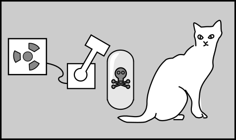

Physics didn't take away your free will, and quantum mechanics didn't give it back
==================

People who have thought hard about free will don't necessarily all agree on it.
The purpose of this piece isn't to convince you of one point of view or another
about free will in general, which wouldn't even be something that I had special expertise on.
I'm a physicist, and what I'm going to do is to present you with a menu of possible
points of view on free will, then explain why it is that, no matter which you choose,
the cold, impersonal laws of physics didn't take away your free will --
nor did quantum mechanics give it back by changing our ideas about randomness.
I've structured this like a series of freeway off-ramps. As soon as you find a
point of view on free will that seems reasonable to you, you can take the off-ramp
and I'll explain why I don't think the laws of physics are relevant for someone of
your persuasion.

*(Biblia Pauperum, public domain. Modified by the author. https://commons.wikimedia.org/wiki/File:BibliaPauperum.jpg )*

Off-ramp number 1: The discussion is meaningless, because "free will" has never been defined satisfactorily.
------------------------------------------------------------------------------------------------------------

If you ask people for their opinions about free will (Clark 2019), you get all kinds of
answers. They contradict themselves.  They seem to engage in motivated reasoning. They may be sure that
they know what the phrase means, but they can't seem to define it in any way that withstands scrutiny. Religions
have their own doctrines about free will, such as the one in [Genesis 3:3](https://ebible.org/web/GEN03.htm) --
but rest assured that the answers supplied by the Abrahamic religions aren't the same as the ones you get from Buddhists.
Philosophers, at least up until fairly recently, didn't seem able to do any better.

One very reasonable point of view, then, is to say that if people want to talk about free will, the burden
is on them to provide a satisfactory definition. If they don't seem to have done so, then we should just
treat it by default as something that doesn't need to be discussed: it's a "pseudo-problem."
This is pretty reasonable, and in fact there was a time around 1920 when it was a very popular point of view
among the kind of people who published papers in philosophy journals.

Clearly if you take this off-ramp then
physics is irrelevant. Physics can't help us to solve a problem if we can't even pose the problem clearly.

Off-ramp number 2: compatibilism
--------------------------------

People mulled this over and published papers with titles like "The Pseudo-problem of Freedom of the Will"
(Schlick 1931) and "Is `Freewill' a Pseudo-Problem?" (Campbell 1951).
Then, surprisingly, there was
progress. The idea was to revive and clarify a point of view called [compatibilism](https://en.wikipedia.org/wiki/Compatibilism).
Compatibilists argue that that there are various situations in which we all agree, as a matter of common sense, that
a certain person lacks free will.

*(Lars Klintwall Malmqvist, PD, https://commons.wikimedia.org/wiki/File:OCD_handwash.jpg )*

For example, someone with [obsessive–compulsive disorder](https://en.wikipedia.org/wiki/Obsessive%E2%80%93compulsive_disorder)
may compulsively wash their hands over and over again. They can't control their own behavior.
There are also lots of silly, fun examples, such as some of the robot parables in Stanislaw Lem's [The Cyberiad](https://en.wikipedia.org/wiki/The_Cyberiad) (one of my favorite science fiction books of all time).

Whether the examples are serious or silly, they can be interpreted in terms of a perfectly reasonable picture
of our world. We have a bunch of organs in our body. The liver has jobs like removing alcohol from the blood and
storing up energy. If your liver gets messed up, you can't function normally. Likewise your brain has jobs like
making decisions. If your brain gets messed up, you lose that ability.

OK, I know it's really, really silly to take surveys on intellectual questions, but just for the record, a
2020 [survey](https://survey2020.philpeople.org/survey/results/4838) showed that compatibilism was the preferred point of view of
about 60% out of several thousand English-speaking academic philosophers .

The reason compatibilism is called compatiblism is that it says there is no conflict between the fact that
the universe seems to have rules and the notion that your brain makes choices if it's in good working order.
So if you take the compatiblism off-ramp, then once again, the laws of physics don't say anything about whether
you do or don't have free will. The laws of physics help to explain why chemistry works the way it does, and
chemistry helps to explain why your brain works (or doesn't work) properly.

Off-ramp 3: Libertarianism
--------------------------

Some people feel uncomfortable with this idea that we can or should reduce the mind to the workings of
the brain. Many of the people who feel this way are religious. (Yes, believe it or not, many professional
philosophers [https://survey2020.philpeople.org/survey/results/4842](are theists).
Among this population, the point of view that is almost completely absent
is agnosticism.) In [Genesis 4:7](https://biblehub.com/interlinear/genesis/4-7.htm), God tells Cain that he is to "rule over" (timshel)
his desire, which Cain takes as the green light to kill his brother. That sounds a lot like
a declaration that people have free will, and they get it from Yahweh. This point of view tends to
be in opposition to naturalism and to embrace something like Cartesian dualism.

So if you agree with this point of view, then again there is nothing about the laws of physics that
is relevant. You're rejecting physics as an explanation of the mind, so physics has no contribution to make.

Off-ramp 4: Incompatibilism
---------------------------

Some people feel that the compatibilists are cheating by moving the
goal posts. Ordinary people, they say, know what they mean by free
will, and it isn't the watered-down version offered by the
compatibilists.  Embrace the suck: the common folk think they have free
will, but science says they don't. Free will is an illusion. Many of
the most visible proponents of this point of view are neuroscientists,
such as Sam Harris. There is a tendency among many of these people to take extreme positions on moral responsibility.
For example Gregg Caruso, who leans toward incompatibilism, believes that there should be only a
"public health-quarantine model" for criminal justice, and that deterrence is wrong.
I would call this the ["Gee, Officer Krupke"](https://en.wikipedia.org/wiki/Gee%2C_Officer_Krupke) conclusion.

If physics was going to have any relevance at all to free will, then it would have to be among the incompatiblists.
The simplest form of the argument would be that our brain is basically a computer, and its operations are ultimately
governed by the laws of physics. Therefore if Cain is thinking about whether to kill Abel, the outcome is predetermined
by the initial physical state of his brain (plus other external sensory impressions that occur while he's thinking, but
those too are part of the physical universe and governed by physical laws).

When you frame the argument this way, it sounds as though it matters that the brain is a *deterministic* computer
governed by *deterministic* physical laws. This makes it sound as though Isaac Newton took away your free will,
with his conception of a universe operating entirely according to such laws -- heaven and earth both, no exceptions.
If so, then you might think that the terms of the whole discussion could be altered by the discovery of quantum
physics, which allows for randomness.
There are two big problems with this idea.

The first problem is that if randomness enters into the functioning of the brain, then there is absolutely no
reason to think that that randomness somehow has implications for the folk-wisdom version of free will
that the incompatibilists say they're taking seriously. Folk-wisdom free will is all about moral responsibility.
If Cain's brain is somehow influenced by some kind of randomness at the atomic level, then if anything, that
would tend to *decrease* his moral responsibility.

*The Schrodinger equation says that Schrodinger's cat is both alive and dead, and the situation is never resolved. It's a matter of interpretation whether this should be rectified by modifying the math.*

The second problem is that it is simply not true that classical physics (meaning the physics that came before
the quantum revolution, ca. 1927) is deterministic, while quantum physics is random.
The notion that classical physics is deterministic just doesn't stand up to more careful analysis.
It's more of a folk-science belief among physicists (Norton 2003).
The very entertaining and readable book by Earman (1995) shows how thoroughly it breaks down in Einstein's
theory of relativity (which physicists consider classical). And as to whether quantum physics is random,
that's a matter of interpretation. Sorry, but it really does matter what you mean by "random." The basic
equation that governs quantum physics, called the Schrodinger equation, is completely deterministic.
It says that a uranium atom is both decayed and not decayed, and that
[Schrodinger's cat](https://archive.org/details/mod_20220102/page/354/mode/2up) is both alive
and dead at the same time, and there's nothing random about it. Some physicists who felt queasy about that
have advocated adding [additional machinery](https://en.wikipedia.org/wiki/Dirac%E2%80%93von_Neumann_axioms) to
quantum mechanics to force a random outcome, but the Schrodinger equation [works equally well without it](https://en.wikipedia.org/wiki/Quantum_decoherence). Real-world physical theories just don't lend themselves to categorization as random or deterministic.

Thanks for reading. I hope I've convinced you that the laws of physics have nothing whatsoever to do with
whether or not we have free will.

[Ben Crowell](http://lightandmatter.com/area4author.html), 2023 Jan. 7

[other blog posts](https://bcrowell.github.io/)

This post is CC-BY-SA licensed.

References
-----

Campbell, 1951, "Is `Freewill' a Pseudo-Problem?," https://sci-hub.se/http://www.jstor.org/stable/2251143

Clark, Winegard, and Baumeister, 2019, "Forget the Folk: Moral Responsibility Preservation Motives and Other Conditions for Compatibilism," https://www.ncbi.nlm.nih.gov/pmc/articles/PMC6374326/

Dennett, 1984, Elbow room: the varieties of free will worth wanting

Earman, 1995, "Bangs, crunches, whimpers, and shrieks: singularities and acausalities in relativistic spacetimes"

Norton, 2003, "Causation as Folk Science," https://quod.lib.umich.edu/p/phimp/3521354.0003.004/1

Schlick, 1931, "The Pseudo-problem of Freedom of the Will" (chapter in a book)
