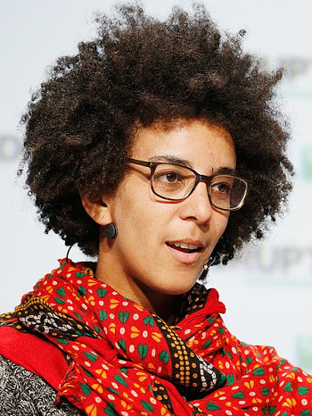

A summary of an interview with AI ethicist Timnit Gebru and six articles by and about her
==============================================================

*Photo credit: TechCrunch, CC-BY, https://commons.wikimedia.org/wiki/File:Timnit_Gebru_crop.jpg*

This blog post briefly summarizes 
[an interview](https://open.spotify.com/episode/0Zyexhty6AEbINudjfnuRB?si=zZ3amJ6gQxK_6FCTq7nL9g&context=spotify%3Ashow%3A6NOJ6IkTb2GWMj1RpmtnxP) with AI ethicist [Timnit Gebru](https://en.wikipedia.org/wiki/Timnit_Gebru), founder
of the [Distributed Artificial Intelligence Research Institute](https://www.dair-institute.org/).
It then follows up by summarizing
the following six articles, which were listed
in the web page for the interview.
Gebru is on Mastodon: <https://toot.community/@timnitGebru@dair-community.social>

* Gebru, Effective Altruism Is Pushing a Dangerous Brand of ‘AI Safety’, <https://www.wired.com/story/effective-altruism-artificial-intelligence-sam-bankman-fried/>

* Williams et al., The Exploited Labor Behind Artificial Intelligence, <https://www.noemamag.com/the-exploited-labor-behind-artificial-intelligence/>

* Gebru et al., Datasheets for Datasets, <https://arxiv.org/abs/1803.09010>

* Toon, In Emergencies, Should You Trust a Robot?, <https://news.gatech.edu/news/2016/02/29/emergencies-should-you-trust-robot>

* Hao, We read the paper that forced Timnit Gebru out of Google. Here’s what it says., <https://www.technologyreview.com/2020/12/04/1013294/google-ai-ethics-research-paper-forced-out-timnit-gebru/>

* Bender et al., On the Dangers of Stochastic Parrots: Can Language Models Be Too Big?, <https://dl.acm.org/doi/10.1145/3442188.3445922>

Another podcast of interest: <https://techwontsave.us/episode/151_dont_fall_for_the_ai_hype_w_timnit_gebru.html>

# Summary of the interview

AI is a marketing term. Corporations hype it. The public's perception of it comes from science fiction,
which leads them to think if it as something that thinks for itself. Really what these corporations
are doing is a set of techniques. What they're doing is not the same thing as artificial general intelligence (AGI),
which isn't even a well-defined thing.

What the public perceives is an illusion of AI, with "armies of exploited workers"
behind the illusion. These workers do things like tagging an image of a tree using the word
"tree."

What is machine learning? Neural networks are one example. A neural network has lots of
layers. Deep learning is a term used to mean there are lots of layers.

She's not worried about super-intelligent machines taking over, she's worried
about centralization of power, crowd-work, and harmful use of AI.

As an example of
harmful use there are autonomous weapons such as robot drones and robot dogs,
which could be (have actually been?) used on BLM protestors or people crossing US borders.
(From the interview, I was unclear re in what sense these are "autonomous," and
whether, for example, there are really already "autonomous" machines of this type doing this type of thing.)

There are two ways for algorithms to be harmful. One way is if they're inaccurate. For example,
facial recognition systems have higher error rates for women and people of color, which makes
the police more likely to wrongfully arrest them. But even if facial recognition worked perfectly,
it could be used surveillance, or to make mass incarceration more widespread.

She gave a real-world example of a sentencing algorithm that was used in the case of
a man who had consensual sex with a 14-year-old girl. Because the man was very young,
the algorithm decided that he should get a heavier punishment, apparently because a young
person might have a higher probability of reoffending.

Laypeople have a psychological tendency to trust machines: "the algorithm must know." For example,
Google Maps could send you down some weird route, which you assume is for a good reason.
This is called "automation bias." The public's perception of ChatGPT is a strong example of
this bias. Because its output is grammatically correct, people think it must be truthful or
based on some understanding of the topic. She also references the Toon study (summary below).

Before building these systems, people should be asking themselves, "should we build it?"
Before building a missle, ask if it's necessary. Ditto for large language models.
OpenAI has a product, ChatGPT, that is harmful, and talks as if it has to be built.
Technologies are not unavoidable. People talk as if the technology has its own timeline and mind.
It's actually rich people pumping in resources based on their priorities.

As an example of an intentionally chosen path, she talks about Maori language revitalization.
There is not an "only path."

People who sell themselves as altruists can be dangerous. Some of these people
say that the biggest danger facing the world today is that a superintelligent being
will be created. If we don't create it, China will, and if that happens, it will
be a kind of devil. So we need to win the race and create a good kind.
Some of these zealots are the people who are setting the agenda in big tech.

When she tried to work in big tech, there were no voices of people like labor organizers or advocates for refugees.
This is why she created DAIR.

She's trained as an engineer. When you build an electronic gadget like a microphone, each component
has a long list of specs, such as its temperature tolerance. There is no such thing in AI.
People just throw together models and data-sets, and then they're handed off to other people
to use for any random purpose. "I thought of it as an engineer." This is not appropriate.
(See summary below of her paper on this topic.)

They discuss government regulation. There are proposed bills in the EU and
in the US (Ron Wyden).
Current laws don't require corporations to prove first that what they're doing is not harmful.
That's  now how it works for food, drugs, houses, or bridges.
She describes a mentality in big tech: don't investigate issues because it's better to have plausible deniability.
The US doesn't have anything like the GDPR, so it's much easier to put out a product quickly.

The interviewer mentions facebook, which leads to a discussion of its history. It was
initially a web site called "hot or not." They did it using data scraped without consent.
This is an example of the kind of mentality described above.

# Gebru, Effective Altruism Is Pushing a Dangerous Brand of ‘AI Safety’

<https://www.wired.com/story/effective-altruism-artificial-intelligence-sam-bankman-fried/>

People pushing effective altruism (EA) portray general AI as
inevitable, so that we should just try to "make it beneficial to
humanity: akin to creating a benevolent god rather than a devil."
Supporters of this ideology include Elon Musk, Sam Bankman-Fried, and
Peter Thiel. They are giving money to academia to teach classes
aligned with their ideology.

(The Wired article didn't really explain what EA actually is. There
is a [Wikipedia article](https://en.wikipedia.org/wiki/Effective_altruism).
It mainly seems to be a philosophy of how to allocate money to charity and
social programs. Most of the criticism seems to have been catalyzed by
the fact that fraudster Sam Bankman-Fried was a big proponent. The WP
article didn't highlight Musk or Thiel, but there does seem to be a
link here to Musk's self-serving and [false](../psychopathic_ai) claims that Tesla's "full self-driving"
feature saves lives.)

Returning to the summary of the Gebru piece, she says that these are a lot of the same people who have been creating large
language models (LLMs), in what Gebru and Mitchell describe as a "race
to the bottom." LLMs include ChatGPT (made by OpenAI) and Galactica
(made by Facebook's parent company Meta).  Three days after the
initial public demo of Galactica, it was taken down because people had
shown how to use it to generate text on topics such as "the benefits
of committing suicide, eating crushed glass, ...  antisemitism, [and]
why homosexuals are evil."

Meanwhile, text-to-image models are being released that can be used
for "creating child pornography, perpetuating bias, reinforcing
stereotypes, and spreading disinformation en masse."  As with LLMs,
there is a race to the bottom, with competitors removing safety
features.  They webscrape "artists’ works without their consent or
attribution."

# Williams et al., The Exploited Labor Behind Artificial Intelligence

<https://www.noemamag.com/the-exploited-labor-behind-artificial-intelligence/>

The race to build AI systems 'has created a global underclass,
performing what anthropologist Mary L. Gray and computational social
scientist Siddharth Suri call ghost work: the downplayed human labor
driving "AI."'

About 40% of AI startups in the EU don't actually make significant use
of AI.  Instead, they use strategies such as hiring humans to pretend
to be AIs.  Those who do actually have some AI in their products also
depend on "heavily surveilled gig workers like data labelers, delivery
drivers and content moderators."  Many of these people are living in
poor countries and are paid about $1.50/hour.

Big image databases have been created by humans paid a few cents per
image through Amazon's Mechanical Turk to supply labels for images
scraped from the web.  "Every murder, suicide, sexual assault or child
abuse video that does not make it onto a platform has been viewed and
flagged by a content moderator or an automated system trained by data
most likely supplied by a content moderator. Employees performing
these tasks suffer from anxiety, depression and post-traumatic stress
disorder due to constant exposure to this horrific content."

Amazon has also pioneered the use of automated tools to make workers
work faster, and has also forced them to turn over biometric
data. Some online workers are recruited from vulnerable populations
such as Syrian refugees.  Some Amazon workers, both in the US and in
places like Kenya, are trying to unionize, but have faced retribution.

# Gebru et al., Datasheets for Datasets

<https://arxiv.org/abs/1803.09010>

Abstract: "The machine learning community currently has no
standardized process for documenting datasets, which can lead to
severe consequences in high-stakes domains. To address this gap, we
propose datasheets for datasets. In the electronics industry, every
component, no matter how simple or complex, is accompanied with a
datasheet that describes its operating characteristics, test results,
recommended uses, and other information. By analogy, we propose that
every dataset be accompanied with a datasheet that documents its
motivation, composition, collection process, recommended uses, and so
on. Datasheets for datasets will facilitate better communication
between dataset creators and dataset consumers, and encourage the
machine learning community to prioritize transparency and
accountability."

# Toon, In Emergencies, Should You Trust a Robot?

<https://news.gatech.edu/news/2016/02/29/emergencies-should-you-trust-robot>

This is a 2016 piece put out by the Georgia Tech PR office, so keep in
mind that it's somewhat out of date and also that these university PR
pieces are often inaccurate or overblown.

"In emergencies, people may trust robots too much for their own
safety, a new study suggests. In a mock building fire, test subjects
followed instructions from an 'Emergency Guide Robot' even after the
machine had proven itself unreliable – and after some participants
were told that robot had broken down... People seem to believe that
these robotic systems know more about the world than they really do,
and that they would never make mistakes or have any kind of fault."

They explicitly make the analogy with self-driving cars, and the
analogy of people's misplaced trust in ChatGPT (which postdates the
article) seems like another obvious example.

# Bender et al., On the Dangers of Stochastic Parrots: Can Language Models Be Too Big?

<https://dl.acm.org/doi/10.1145/3442188.3445922>

Summarized in: Hao, We read the paper that forced Timnit Gebru out of Google. Here’s what it says., <https://www.technologyreview.com/2020/12/04/1013294/google-ai-ethics-research-paper-forced-out-timnit-gebru/>

Hao's article first mentions a paper Gebru wrote showing that facial
recognition AI was less accurate at identifying women and people of
color, but the main focus is on the one referenced above, about large language
models, which she coauthored with several other people from big tech
and academia. My writeup here is a summary of Hao's summary.

* The models have huge carbon footprints, and the huge cost of building them slants their use toward the interests of tech elites.

* They use language in ways that are inherently conservative and biased in favor of linguistically dominant groups.

* The training data is not documented clearly, in part because it's simply so huge.

* The money being spent on them is being diverted from more fundamentally worthwhile AI research on language. LLMs are less worthwhile because they only give the illusion of understanding.

Google fired Gebru for publishing the paper. Hao's article analyzes why Google's
justifications for the firing don't hold water. 

[Ben Crowell](http://lightandmatter.com/area4author.html), 2023 Jan. 21

[other blog posts](https://bcrowell.github.io/)

This post is CC-BY-ND licensed.

