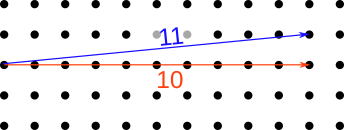

Euclid meets Dalí: the metric in Einstein's theory of relativity
==================

When Syracuse fell to the Roman army in 212 BCE, soldiers were sent to capture
the mathematician and engineer Archimedes, who was considered a valuable military asset.
[Legend has it](https://en.wikipedia.org/wiki/Noli_turbare_circulos_meos!) that when the soldiers arrived, he was drawing geometrical diagrams in
the sand, and he said, "Please don't disturb my circles." An angry soldier killed him.

*(The death of Archimedes, by Giani.)*

Euclid's third postulate is that a circle exists with any given center and radius.
What was revolutionary about that was not the seemingly unobjectionable
claim about physical space, it was the idea that *this* was the kind of thing
that you would write down in order to describe the order of things in the world.
Not a statement about gods or warlords, myths or miracles, but one about the universe
as something that the human mind can encompass and *measure*.

In mathematician-speak, Euclid endowed space with a *metric*, meaning
a set of mathematical machinery that allows us to say things like,
"this pencil is the same length as that one." In these terms, what
Einstein did was to play with Euclid's metric and make newer, weirder
versions of it that could be applied to both time and distance on the
same footing.

*Relativity without the metric is like Matisse without color.*

Although the metric is the unifying thought-tool of this
whole story, and professional relativists think of it as their main
topic of study, both the word and the concept are strangely absent from
most popularizations and college sophomore-level presentations of relativity.
I don't think that's because it's inherently a hard thing to understand -- it's not.
The reason is probably just that education tends to be incredibly conservative,
so we follow the mode of presentation that was developed for the ideas of relativity
from about 1905 to 1915, when the central role of the metric wasn't yet clear.
That's a shame, because when laypeople are curious about black holes and the big
bang, they tend to get held back by not hearing about the metric. It's as though
people who wanted to know about the visual arts were inexplicably never told
about color.

Why this metric and not some other?
---------------------------------

Euclid believed that he was uncovering essential logical truths about how the world
should behave. Modern mathematicians would say that you get a huge amount of latitude
in defining a metric -- anything goes, as long as it meets some basic criteria.
Physicists these days have more sophisticated philosophical take. Choosing a metric is
like choosing a romantic partner. Sure, you *could* pick anyone, but some choices are
nicer than others.

To make this more concrete, consider the example in the figure. Euclid's axioms are
(almost) logically equivalent to the [Pythagorean theorem](https://en.wikipedia.org/wiki/Pythagorean_theorem),
which says that if you move x units to the right, and then y units up, the distance r that you've traveled as the
crow flies is given by r²=x²+y². (If you want to solve more explicitly for r, you can take the square root of both sides.)
The diagram below shows a typical result. 

Notice how in this example the two results are surprisingly close together. That's because when you square things,
it makes the big things even bigger compared to the small things. As an example of how this matters in our universe,
notice how the weight of the slackliner in the photo makes the rope sag. Even if you made the rope extremely tight,
it would still sag quite a bit. The proportions for one half of the rope look pretty close to 10 meters to 1 meter.
So in order to get the rope to sag by one meter, it only had to stretch by about 0.05 m along the length of each half.

*(Wikimedia Commons user Jeff P, CC-BY licensed. https://commons.wikimedia.org/wiki/File:Yosemite_Highlining_(15554008495).jpg )*

It's not at all hard to conceive of a metric that doesn't have these squares in it, which would seem simpler.
Here's a picture of the result for the version without the squares, r=x+y, when we go 10 dots to the right and 1 dot up.
The result is just 11. This is often referred to as the [taxicab metric](https://en.wikipedia.org/wiki/Taxicab_geometry), because it's
effectively what you care about if you're driving a car on a city whose streets are a square grid.

It seems like it would be a great idea to choose this metric as our new boyfriend. What could possibly go wrong?
Well, take a look at what he does when we ask him to draw a circle of radius 2. You can check that every dot marked
by the green outline lies at a taxicab distance of 2 from the same center. "Yeah, baby," he says confidently. "That's
how I roll."

It looks more like a diamond than a circle. But is that just our uptight bourgeois values at work? After all, our
eye easily accepts this aerial photo as a circle, and we could easily make it fit the Pythagorean theorem in its
usual form simply by adopting the graph-paper grid shown in the figure. There's no principle that says that the
*representation* of the shape has to look like anything in particular; that's just a matter of how we *embed*
reality into the pixels on a screen, or *label* them with coordinates like x and y.

But the green diamond really does lack the symmetry of a circle, and this is not just a matter of the embedding or
representation we've chosen. To see that, consider the points marked in red and blue on the taxicab-metric "circle."
The red dot has one black dot as its inside neighbor, at a distance of 1 from it. The blue dot, on the other hand,
has two such distance-1 neighbors.

The issue with the taxicab metric is that it lacks the rotational symmetry that was baked in to Euclidean geometry
by one of Euclid's other postulates, which states that all right angles are the same as each other. This way of
looking at geometry is called the [Erlangen program](https://en.wikipedia.org/wiki/Erlangen_program): that we should
understand geometry based on what kinds of changes we can get away with. One of the characteristics of Euclidean
geometry is that we can rotate objects however we like, and when we do that, distances and angles stay the same.

A metric for spacetime
----------------------

*(Photo by Wikimedia Commons user Timothy McDougall, public domain. https://commons.wikimedia.org/wiki/File:Rotonda.jpg )*

[Ben Crowell](http://lightandmatter.com/area4author.html), 2023 Jan. 5

[other blog posts](https://bcrowell.github.io/)

This post is CC-BY-SA licensed.

