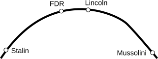
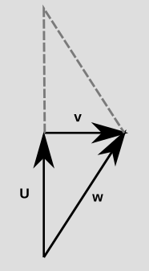

Euclid meets Dalí: the metric in Einstein's theory of relativity
==================

When Syracuse fell to the Roman army in 212 BCE, a squad of soldiers was sent to capture
the mathematician and engineer Archimedes, who was considered a valuable military asset.
[Legend has it](https://en.wikipedia.org/wiki/Noli_turbare_circulos_meos!) that when they arrived, he was drawing geometrical diagrams in
the sand, and he said, "Don't disturb my circles." An angry soldier killed him.

*"Don't disturb my circles." (The death of Archimedes, by Giani.)*

Euclid's third postulate is that a circle exists with any given center and radius.
What was revolutionary about that was not the seemingly unobjectionable
claim about physical space, it was the idea that *this* was the kind of thing
that you would write down in order to describe the order of things in the world.
Not a statement about gods or warlords, myths or miracles, but one about the universe
as something that the human mind can encompass and *measure*. The drawing shows Archimedes
using a compass, which is the only distance-measuring device in the [physical embodiment of
Euclid's thought-system](https://en.wikipedia.org/wiki/Straightedge_and_compass_construction).

In mathematician-speak, Euclid endowed space with a *metric*, meaning
a set of mathematical machinery that allows us to say things like,
"this pencil is the same length as that one." In these terms, what
Einstein did was to play with Euclid's metric and make newer, weirder
versions of it that could be applied to both time and distance on the
same footing.

*Relativity without the metric is like Matisse without color.*

Although the metric is the unifying thought-tool of this
whole story, and professional relativists think of it as their main
topic of study, both the word and the concept are strangely absent from
most popularizations and college sophomore-level presentations of relativity.
I don't think that's because it's inherently a hard thing to understand -- it's not.
The reason is probably just that education tends to be incredibly conservative,
so we follow the mode of presentation that was developed for the ideas of relativity
from about 1905 to 1915, when the central role of the metric wasn't yet clear.
That's a shame, because when laypeople are curious about black holes and the big
bang, they tend to get held back by not hearing about the metric. It's as though
people who wanted to know about the visual arts were inexplicably never told
about color.

Why this metric and not some other?
---------------------------------

Euclid believed that he was uncovering inherent logical truths about how the world
should behave. Modern mathematicians, on the contrary, would say that you get a huge amount of latitude
in defining a metric -- anything goes, as long as it meets some basic criteria.
Physicists these days have a more nuanced philosophical take. Choosing a metric is
like choosing a romantic partner. Sure, you *could* pick anyone, but some choices are
nicer than others.

To make this more concrete, consider the example in the figure. Euclid's axioms are
(almost) logically equivalent to the [Pythagorean theorem](https://en.wikipedia.org/wiki/Pythagorean_theorem),
which says that if you move x units to the right, and then y units up, the distance r that you've traveled as the
crow flies is given by r²=x²+y². (If you want to solve more explicitly for r, you can take the square root of both sides.)
The diagram below shows two examples.

Notice how close the two results are. That's because when you square things,
it makes the big things even bigger compared to the small things. If you take a look at what happens when you plug
in the numbers 10 and 1 for the blue vector, you'll see that the second term becomes almost negligible compared to the first.

As an example of how this matters in our universe,
notice how the weight of the slackliner in the photo makes the rope sag. Even if you made the rope extremely tight,
it would still sag quite a bit. The proportions for one half of the rope look pretty close to 10 meters to 1 meter.
So in order to get the rope to sag by one meter, it only had to stretch by about 0.05 m along the length of each half.

*(Wikimedia Commons user Jeff P, CC-BY licensed. https://commons.wikimedia.org/wiki/File:Yosemite_Highlining_(15554008495).jpg )*

It's not at all hard to conceive of a metric that doesn't have these squares in it, and that would seem simpler.
Physicists have found by experience that when they try to guess how nature behaves, it's usually a good idea to
make your hypotheses as simple as possible -- but no simpler!

Here's a picture of the result for the simpler version without the squares, r=x+y, when we go 10 dots to the right and 1 dot up.
The result is just 11. This is often referred to as the [taxicab metric](https://en.wikipedia.org/wiki/Taxicab_geometry), because it's
effectively what you care about if you're driving a car on a city whose streets are a square grid. The poor driver doesn't
get any benefit from the fact that the blue "as the crow flies" line looks shorter on your computer screen. To a being living in
a universe with a taxicab metric, that wouldn't even be what a line would look like; it would look like one of the various
eleven-block paths, which appear to our eyes as "staircase" shapes.

It seems like it would be a great idea to choose this metric as our new boyfriend. What could possibly go wrong?
Well, take a look at what he does when we ask him to draw a circle of radius 2. You can check that every dot marked
by the green outline lies at a taxicab distance of 2 from the same center. "Yeah, baby," he says confidently. "That's
how I roll."

It looks more like a diamond than a circle. But is that just our uptight bourgeois values at work? After all, our
eye easily accepts the aerial photo below as a circle, and we could easily make it fit the Pythagorean theorem in its
usual form simply by adopting the graph-paper grid shown in the figure. There's no principle that says that the
*representation* of the shape has to look like anything in particular; that's just a matter of how we *embed*
reality into the pixels on a screen, or *label* them with coordinates like x and y.

*(Photo by Wikimedia Commons user Timothy McDougall, public domain. https://commons.wikimedia.org/wiki/File:Rotonda.jpg )*

But the green diamond really does lack the symmetry of a circle, and this is not just a matter of the embedding or
representation we've chosen. To see that, consider the points marked in red and blue on the taxicab-metric "circle."
There is only one optimal path for a cab from the center to the red dot (as in Euclid's axiom that two points determine
a line), but more than one from the center to the blue dot.

The issue with the taxicab metric is that it lacks the rotational symmetry that was baked in to Euclidean geometry
by one of Euclid's other postulates, which states that all right angles are the same as each other. This way of
looking at geometry is called the [Erlangen program](https://en.wikipedia.org/wiki/Erlangen_program): that we should
understand geometry based on what kinds of changes we can get away with. One of the characteristics of Euclidean
geometry is that we can rotate objects however we like, and when we do that, distances and angles stay the same.

Now it's time to talk about how all of this plays out when we talk about the geometry of spacetime (Einstein's
unified description of space and time) rather than just space. I have a separate, short [blog entry on spacetime](../spacetime_diagrams)
that provides the relevant background, which consists of the following: spacetime diagrams, vectors in spacetime,
relativity of time, proper time, representation of the speed of light on a spacetime diagram, natural units,
c=1, and the light cone.

A metric for spacetime
----------------------

Looking at a typical example from relativity, we have the following simplified version of the experiment described
in that previous blog entry. One atomic clock flies on an airplane, while another one stays at home. Notice how it looks like,
well, a triangle! This is the kind of thing that gives us a feeling that we should be able to use the same geometrical
tools for spacetime as for Euclidean space. The clocks disagree when reunited. The "length" of each vector is
quantified by its proper time. 

If you thought that ruler distances on paper were valid indications of clock time, then you would expect the
traveling clock to record more time than the home-base one. But remember, it's always the clock that *doesn't*
undergo anything but smooth motion that experiences the most time. That is, it's the other way around compared
to what you'd think from the lengths on the page. In the other blog post, I suggested thinking
of the line segments as roads, and the clock times as indications of how many gas stations
you pass on those roads. The "number of gas stations" idea is precisely the metric. 

It's important to realize here that although time is relative, the results we get when measuring with the metric
are absolute. This is like the difference between saying that human sacrifice is wrong and admitting that the
people who *practice* it believe that it's right. A clock is *right* about the proper time measured along its *own*
world-line. With equal justice, the theory of relativity could have been called the theory of absolutivity.

*It's all relative, man. (Keith Henderson, 1922, PD, https://commons.wikimedia.org/wiki/File:COM_V2_D273_Prisoners_for_sacrifice_were_decorated.png )*

In terms of the Erlangen program, we want a metric
that correctly predicts these proper times, and we should get the right result regardless of two types of
choices that we make when picking our frame of reference: (1) choosing how we rotate our point of view, and (2) choosing
our state of motion. [Experiments show to incredible precision](https://en.wikipedia.org/wiki/Modern_searches_for_Lorentz_violation)
that experiments come out the same regardless of both types of choices.

What's not immediately obvious is how to fold together the space-measuring and time-measuring stuff in a graceful way.
When I was a kid, my pot-smoking relatives told me that time was the fourth dimension. Far out, man. 
But we know that this isn't exactly true, because time doesn't behave like space. For example, we can
freely choose to move around in space, but not in time. This is why physicists talk about spacetime as
having 3+1 dimenions rather than 4. A vector that points outside the light cone (called a spacelike vector) really
is different from one that lies inside the light cone (a timelike vector).

Furthermore, rotation of our frame of reference seems superficially pretty different from changing our state of
motion. One is measured in units like degrees, the other in velocity units (which are actually non-units if we
use natural units, where c=1). It's not really true in any meaningful sense that time is an axis "at 90 degrees"
to the spatial ones.

Orthogonality
-------------

A good way to clear up this thicket of confusion is to recognize that the idea of "perpendicular" is much
more general than the one known to Euclid and carpenters. To build an analogy, let's bring back that new
boyfriend. You bring him home to meet your parents, and he announces over dinner that he really admires a
certain politician. Do they judge him for it?

Most of us would probably agree, as a general statement, that there can be people a little to our right or
left politically who are still perfectly fine, decent human beings. As a geometrical figure of speech,
people will say that ideology and morality are "orthogonal."
But if he's just announced himself
as a fanboy of Mussolini, maybe we take that back. *Large* changes matter a lot.

This kind of nonlinear, "little changes don't matter, large ones do," behavior is exactly what we see in
geometry, as shown in the figure above, where we compare the Euclidean distances of some points from a
single, fixed point way over on the left. The up-down direction is orthogonal to the horizontal one,
so small changes hardly change the distance at all. This is different from left-right changes, which
produce a one-for-one effect.

In the Pythagorean theorem, as we saw earlier, the squares in the formula x²+y² are what produce this behavior. The fact that these
squares exist is also directly related to the rotational symmetry of space. If you take a look at the
green-red-blue sequence in the figure, you'll see that the sequence of distances goes 10.05, 10, 10.05. The numbers decrease and
then come back up, and they do it in a symmetrical way. Suppose instead that it had shown a steady trend,
maybe 9, 10, 11, just like the orange-red-pink series. That would violate the symmetry of space. There would be something special about up compared
to down. Spinning the paper upside down would produce the opposite trend, which would be a contradiction to our expectation of symmetry
and leave us wondering how to tell which version of the diagram to trust -- the original one or the upside-down one.

In fact, the taxicab metric would have exactly this problem if we used the formula r=x+y, because of the handling
of the plus and minus signs. A y=-1 would have given a result of 9. In fact, if we really want to do taxicab geometry,
we should use absolute values, something more like r=|x|+|y|. The source of taxicab geometry's asymmetries then becomes
a little more clear. If you graph the absolute-value function, it has a kink in it, as in the example below from economics.
The kink is what produces the undesirable asymmetrical corners on the taxicab "circle."

Simultaneity is a kind of orthogonality.
---------------------------------------

To see how this helps us make sense of relativity, consider the experiment shown in the figure. The
scientist's spacetime displacement vector goes from A to C. The diagram is drawn the way she would draw
it in her own frame of reference: she is at rest the whole time, so the arrow points straight up.
At A she sends out a space probe to the right at a certain speed relative to her. It's programmed to cruise for a certain
time, then, at event D, turn around and blast its rocket engines so that it comes back at the same speed (again relative to her). It arrives back
at event C. The scientist measures the time from A to C, so retrospectively she can identify the event B that was
at the mid-point. Based on this experiment, she can say that events B and D were simultaneous. (This procedure is referred to
as Einstein synchronization of events B and D.)

So according to this observer, her own vector is purely in the time direction, while a vector from B to D, →, would be purely spatial.

We can't say that B and D are simultaneous in any *absolute* sense. An
observer in a different state of motion would say that they weren't.
But to her, they are. The fact that they are simultaneous *to her* can
be summarized as a fact about the relationship between her own vector,
which looks like this ↑, and the B-D vector, which looks like this
→. They look perpendicular when drawn this way, in this frame, and we
do say that they're "orthogonal," but not for that reason. The rules
of orthogonality, like the rules of length-measurement for vectors,
are not the ones we would guess from the representation of the arrows
on a piece of paper. We can't always infer whether vectors are
orthogonal based on whether they form a 90-degree angle when we draw
them.

The reason we use the word "orthogonal" here is that these two vectors are orthogonal in the
sense described earlier: when the distance BD is small, the resulting effect on time is small.
Only when the distance is big (i.e., when the motion is very fast) do we get a big time dilation.
Furthermore, if we had placed D at an equal distance to the *left* of the AC line, we would have gotten the same
clock readings.

As a preliminnary to the rest of our discussion, it's useful to be able to talk about stretching and flipping a vector.
Suppose c is just some number, like 3. Then 3**u** means the vector **u** stretched to
three times its original length, while for c=-1, -**u** means the vector **u** flipped around.

We also want to define a notion of adding two vectors, which means that we put them from tip to tail and then draw a
vector from the tail of the first one to the unattached tip of the second. This is what's going on
in the examples above where we drew triangles in spacetime. It simply means that instead of doing one vector and then
another, we go straight to our destination, moving smoothly and not taking any detours.

The inner product
-----------------

With this motivation, we define something called the inner product of two vectors. The inner product is
the metric of Einstein's theory of relativity. (If you took
precalculus in high school, or engineering-type STEM classes in college, then you learned
about the analogous Euclidean thing, which is called the dot product.)

We start with two physics-based definitions that connect the math to what it represents:

* When a clock has a certain world-line, a portion of which is some vector **u**, we define the inner product **u**⸳**u** to be the square of the elapsed time on the clock. For convenience, we may notate this squared time as I and call it the *interval*.

Reason: The squaring stuff will make a lot of things turn out nicely, as in all our previous examples. Note that our definition makes the result of the inner product an ordinary number, not a vector. That is, the inner product is a machine that takes two vectors as its inputs, and gives a number as its output.

* When vectors **u** and **v** are orthogonal (e.g., one is a vector of simultaneity as seen by an observer whose world-line coincides with the other), we define **u**⸳**v**=0.

Reason: If we think of this by analogy with the number line in elementary school, a positive number would be like Mr. Bunny taking some hops to the right,
which we would naturally represent as an arrow pointing in the positive direction. If we want the inner product to act sort of
like ordinary multiplication, then multiplying two arrows in the same direction should give a positive result, while multiplying two arrows with
directions opposite to one another should give a negative output, like 2x-3=-6. Orthogonality is the intermediate case, so it should give zero.

We also require that the inner product have the following algebraic properties, which are analogous to ordinary multiplication and also
ensure that it fits in with the mechanics of how we string together vectors ("add" them) on a spacetime diagram.

* **u**⸳**v**=**v**⸳**u** (commutativity)

* **u**⸳(**v**+**w**)=**u**⸳**v**+**u**⸳**w** (distributivity)

Example: Suppose that **u** is your spacetime displacement vector as you sit on the couch and watch one second go by. Then **u**+**u** is you doing this for two seconds. By our definitions, we expect that the interval for **u**+**u** should equal 2²=4. To check that it does, we take (**u**+**u**)⸳(**u**+**u**) and rewrite it as (**u**+**u**)⸳**u**+(**u**+**u**)⸳**u** (distributivity), which is 2(**u**+**u**)⸳**u**. By commutativity, this is the same as 2**u**⸳(**u**+**u**), and going again with distributivity then makes it 2**u**⸳**u**+2**u**⸳**u**=4**u**⸳**u**=4, as expected.

Measuring spacelike vectors
---------------------------

Something strange happens now when we compute the interval of a spacelike vector. First off, it's not even obvious that what we've said
so far about the inner product even suffices to define a system of spatial measurement. We might naively think that we could just draw the vector
on paper, then draw another one with a ruler that has the same length but is in a timelike direction, and take the inner product on that.
But as we saw with examples like the aerial photograph and the "gas stations" idea, using ruler distances doesn't necessarily work.

In fact, there is no way, based on our rules, that a spacelike vector can have an interval that is some *positive* number. The reason for this
is that it would then have the same measure as some timelike vector. But when any two vectors have the same metric measure, they are
equivalent in the sense that they could actually *be* the same vector, just seen in a different frame of reference.

For example, this figure shows two photos of a pen on a desktop. 

You can probably tell that these are two copies of the same
photo, because the desktop has a wood grain to it,
and the wood is oriented differently in the two images. This is the same scene in two different frames of reference.
This example shows that it can be a little tricky to define whether two vectors are "really"
the same. Vectors that look different could actually be the same vector, just seen by observers
whose frames of reference are rotated or in motion relative to one another.
If two vectors have the same measure, then we can always turn one into the
other by some change in our frame of reference. For spacetime vectors in 3+1 dimensions, this may require
some combination of a rotation and a change in your state of motion.[^benjamin_button]
Two such vectors, which have the same interval, can be considered equivalent.

So we can't allow any timelike vector to have the same measure (interval) as any spacelike vector, because we know that it is not
possible to turn time into space or space into time simply by changing our frame of reference. It turns out that the solution is
simple: the interval has to have opposite signs for timelike and spacelike vectors. The convention I'm using here is that the
interval is positive for timelike vectors, so it's negative for spacelike ones.

To see that this isn't just an arbitrary choice, consider our by-now familiar example of the traveling clock and stay-at-home clock.
The figure above shows the bottom half of the diagram, expressed using vectors and vector addition.
The vector **u** is the first half of the world-line of the stay-at-home clock. The vector **v** is a vector of simultaneity, as
judged by an observer in the stay-at-home state of motion, and **w** is the first half of the traveling clock's world-line.
The vectors **u** and **v** are arranged tip-to-tail, and **w** goes from the tail of the first one to the tip of the second one.
This is our definition of adding vectors, so **w**=**u**+**v**. If we now take the metric measure (interval) of **w**, we
have **w**⸳**w**=(**u**+**v**)⸳(**u**+**v**). Since **u** and **v** are orthogonal, when we multiply this out, the **u**⸳**v** and
**v**⸳**u** terms are zero, and the result simplifies to **w**⸳**w**=**u**⸳**u**+**v**⸳**v**. Now **u** and **w** are timelike
vectors, so we have the squared-clock-time interpretation the **w**⸳**w** and **u**⸳**u** pieces of this equation. But recall
that the stay-at-home clock experiences *more* time, so that **u**⸳**u**>**w**⸳**w**. This proves that **v**⸳**v** is negative.

By the way, the focus of this article is only the metric itself, not a complete presentation of relativity, but it's
worth making the point that the rest of the theory is pretty much implicit in these facts about the metric. As an
example, suppose we actually want to calculate how much time is elapsed on the two clocks in the diagram. We can do
that using the metric. I don't want to distract from the main points here by writing out the full calculation in the
main text, so I'll just give the setup in one footnote[^gamma_setup] and the calculation in another footnote.[^gamma] If you enjoy this
sort of thing, you can look at the setup and then try to get the calculation on your own without peeking.
Or if you just want to see a typical numerical result for concreteness, then when
the velocity is 0.6 (60% of the speed of light), the time ratio is 1.25.

Einstein's motorcycle
-----------------

At the Swiss Federal Polytechnic school, a physics student, about 20 years old,
was sitting in the back of a classroom, absorbing a lecture on electromagnetism,
when he came back to a troubling, half-formed fantasy that he had originally imagined
at the age of 16. Suppose, Albert Einstein daydreamed, that I ride on a motorcycle
at nearly the speed of light, chasing a light wave as it passes over me. What would I
observe? And what would happen if I rode *at* the speed of light?

As a final demonstration of the power of the metric, let's use it to resolve this mystery.
(Spoiler: No, it doesn't like like making the "jump to hyperspace" in Star Wars.)

If we draw the vector ↑ and then start drawing all the possibilities in between that and →, we will eventually have to
transition from positive intervals to negative ones. At the transition point, we'll have a vector whose interval is
zero. Conventionally, we draw our diagrams so that the scales are properly matched on the time and space axes, and
then the zero interval is what occurs when the vector's representation on paper is at an angle of 45 degrees, like ↗.
This amount of tilt is the speed that we call c, and c also happens to be the speed of light. (c=1 in natural units.)

If we fix our attention on one event, and consider other events in spacetime according to their displacements from it, then
we get a picture like the one shown below. Spacetime gets divided up into three portions, with the boundaries defined by
a double cone. This three-way division is different from the Newtonian two-way setup where there is only the past and the
future.

How should we interpret this weird fact that we can have vectors that aren't zero, but their measure according
to the metric is zero? Let's think about it in terms of Einstein's teenage daydream. He was imagining himself
as an observer. If he's an observer, then the state of his brain changes over time. Initially the neurons are
in one state, but then after some input comes in through his senses, the neurons bink-bonk-flip each other into
some new state. (You can tell from my use of the technical lingo that I have considerable expertise in neuroscience.)
The whole notion of an observer only makes sense if the observer exists for some finite amount of time.

Now if an observer has a world-line that coincides for a while with a certain vector, the vector's measure (the interval)
tells us the square of the amount of time that observer experiences. So if an observer's vector is ↗, with ↗⸳↗=0, that
observer isn't experiencing any time. But an observer can't observe unless time passes so that their mental state
can change. This is a contradiction, so we arrive at the conclusion that observers *can't* travel at the speed of light.

[Ben Crowell](http://lightandmatter.com/area4author.html), 2023 Jan. 5

[other blog posts](https://bcrowell.github.io/)

This post is CC-BY-SA licensed.

Notes
-----

[^benjamin_button]:  It may also require an additional flip of the vector so that a future-directed arrowhead becomes one that points toward the past. For now, let's not worry about that possibility, which is not something that you can do without being Benjamin Button.

[^gamma_setup]: Setup: Let t be the time experienced by the stay-at-home clock in the figure, and s the time for the traveling clock. Then t=√(**u**⸳**u**) and s=√(**w**⸳**w**), and what we're trying to calculate is the ratio t/s. The distance traveled by the moving clock, according to an observer in the stay-at-home frame, is d=√(-**v**⸳**v**). (Note the minus sign!) We expect this to depend on the velocity of one clock relative to the other, which is d/t, so the goal is to express it in terms of that quantity.

[^gamma]: Calculation: We found previously that **w**⸳**w**=**u**⸳**u**+**v**⸳**v**, so that t/s=√[**u**⸳**u**/(**u**⸳**u**+**v**⸳**v**)]. This is the same as √[t²/(t²-d²)], or 1/√[1-(d/t)²].
