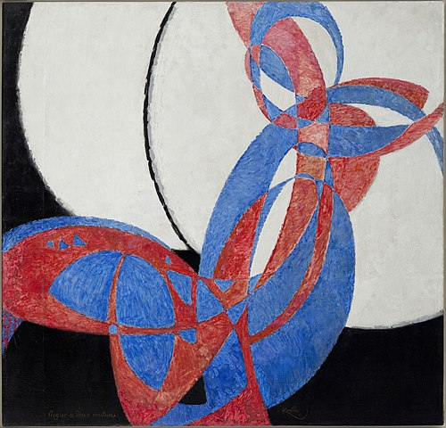
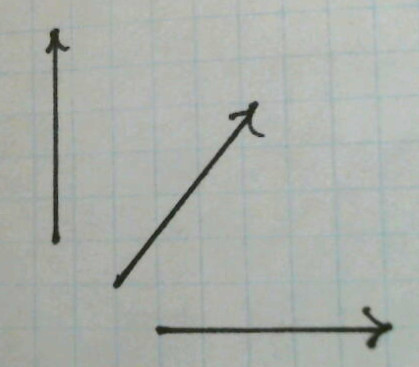
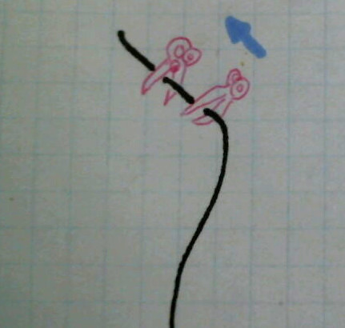

Do we all move through spacetime at the speed of light?
===================================================

You may have heard that according to Einstein's theory of relativity, we all move through spacetime at the speed of light.
Is this true?

Short answer: no.

The rest of this blog post is the long answer. The basic issue is that this characterization has been promoted by popularizers
using loose metaphorical language to try to describe math and physics. They write down some equations and some words, and
they intend you to understand the equations and just use the words as a way to make the medicine go down more smoothly.
But once these verbal misstatements emerge into the wild, they acquire lives of their own, unmoored from what they were
supposed to represent.
It just goes to show that using English to describe math is like using watercolors to describe a symphony. Fidelity and precision suffer.

*A painting that actually was intended to depict a musical form, at least according to the title. Kupka, "fugue en deux couleurs," 1912.*

This idea of "moving through spacetime at c" seems to be something originally perpetrated by the popularizer Brian Greene. To understand
what this would really mean, and why it's at best half-wrong, consider this diagram.

It's a series of snapshots in the a car and a cow.
Time moves forward as we go up the page.
The cow sees itself as being at rest,
while the car drives by on the road.

The following, alternative version shows the same situation in
the frame of reference of the driver,
who considers herself to be at rest while the scenery rolls by.

In relativity, we abstract out some of the artistic details and make a more pared-down
version of these diagrams, which looks like this.

We just show the motion of each object as a line or a curve. Depending on what frame of
reference we arbitrarily choose for the diagram, we can make one line or the other be
vertical (showing the object at rest), or we can make both of them slant. It doesn't
matter which frame of reference we choose. All we can really say in an absolute sense
is that each thing *is* moving -- relative to the other. That's why it's called
relativity.

The lines are called "world-lines." The somewhat odd terminology comes from an awkward
translation of a German phrase that was intended to be something more like "line through
the world," or "line through all of history and existence."

The gray rectangle is referred to as "spacetime." It's a sort of stage, or a piece of graph
paper, that represents both time (vertically) and space (horizontally). If we take the picture and
fill it back in (below) with trees and houses and atoms and religious bigots, it tends to evoke
a subjective view known as the "block universe" or "eternalism." (But there is no block universe
"theory." It's not a scientific theory that makes predictions about experiments, it's just a
mode of thought or description, and it isn't true or false.)

*(Figure by the author and his dog.)*

By the way, absolutely *nothing* I've said so far has anything to do with Einstein's theory of relativity.
All of this could have been written before Einstein was born, as a description of the kind of relativity
originated by Galileo.

So returning to our original question, do we all move through spacetime at the speed of light?
Well, objects don't move through spacetime. Objects move through space. If you depict an object in spacetime, you have a world-line. The world-line doesn't move through spacetime, it simply extends across spacetime, just as the US-Canada border *extends across* the continent but doesn't "move though" it. 

To understand why Greene, in his misguided naughtiness,  would want to say it this way, let's imagine you're sailing on the ocean and you want
to describe the direction you're going. You can do it using a compass bearing from 0 to 360 degrees, which is what sailors actually do, but
to a mathematician's taste, that's a little ugly because of the discontinuity where you "wrap around." Then (ew!) differences of angles don't
always have the expected meaning, because 359 degrees is actually not very different from 0 degrees. A much nicer approach is to use vectors.
For example (1,0) is a pair of numbers that we could say represents motion to the east: for every 1 km we travel along the x axis (east),
we travel 0 km in y (north-south). Similarly, (0,1) would be north, (-1,0) is west, and (1,1) northeast. The only awkwardness is that we can have two
different vectors that represent setting the same course. For example, (2,0) and (1,0) would both mean we were going due east. To fix
this problem, we decree that the x and y parts should always come out to 1 when we put them in the Pythagorean theorem. The fancy
term for this is "normalization." The vector (2,0) isn't normalized, because if you put it in the Pythagorean formula, you get
sqrt(2^2+0^2)=2. To normalize it, we would take that result of 2 and go back and divide everything by that, which would give us (1,0).

Two points will turn out to be crucial for the actual relativity stuff: (1) Normalization doesn't work on a vector that has a length of zero. That's because
that vector doesn't carry any direction information, so no matter how we stretch it or shrink it, it will still be a zero vector.
(2) The normalization is arbitrary. As long as a vector isn't
exactly the zero vector, it can be stretched or shrunk to have *any* standard length. In the image above, all three vectors have bee normalized to 5 graph-paper squares in length. Is that "wrong" because it's not *one* square? No, because in some other set of units it *would* be 1. In fact, the graph paper I used was sold in the US and has 5 squares per inch (an archaic unit used in that country). So in that sense those vectors *are* normalized "correctly."

Now what happens when we use this on a spacetime diagram? The idea would be to chop out some short segment of a world-line, draw an arrow-head on the forward (future) end of it, normalize that, and call that a direction in spacetime. I've tried to depict that in the diagram below. (But I'm a bad artist, so my pink scissors look like squids or something. Sorry.)

We can immediately to see why it doesn't make sense to call the resulting vector (in blue) a speed. We had to choose how much of a piece of the world line to cut out, and that choice was almost entirely arbitrary. We just had to make it short enough so that the curvature of the world-line wouldn't matter much. After that, we would just have to normalize it according to some completely *arbitrary* standard. It's length doesn't tell us the object's speed. Actually what tells us the speed (in the chosen frame of reference) is how much it *tilts*.

Greene's portrayal of us as "moving through spacetime at the speed of light" seems to come from his feeling that if one normalizes the vector to equal the speed of light, then ... its length equals the speed of light. Well, sure, but we could also have normalized it to one dollar or one kilogram or one belly scratch (a canine unit of pleasure). You could ask, OK, *entre nous*, what normalization *is* used by physicists who work on relativity? Well, the universal standard in that community is 1. "One what?" you ask. Just one.

One thing I haven't even discussed yet is what is the formula that plays the role of the Pythagorean theorem for a spacetime diagram. Let's hold that thought for a moment and come back to it, because it will be more obvious in a moment how it would be relevant.

Greene started spreading this bad idea around 2000, but more recently, with people increasingly getting their pop-sci information from videos rather than the printed word, a lot of people seem to be influenced instead by a different and equally ill-considered popularization in a seven-minute video by Sabine Hossenfelder. Her English-language description contradict's Greene's, even though they both certainly understand the physics. 

Hossenfelder presents the following equation: Δs/Δt = sqrt[-(Δx/Δt)^2+c^2]. (I'm omitting the y and z dimensions for simplicity.) 
The notation is:
* Δx = distance between two events
* Δt = time difference between the events
* c = speed of light
* Δs = ...something a little more esoteric, see below

See how there are some squares and square roots, just like in the Pythagorean theorem? If you clear out the factor of Δt and just solve for Δs, then what you have is the closest equivalent in spacetime to the Pythagorean formula.

But what is Δs? Hossenfelder interprets Δs as a sort of "spacetime distance." She can call it that if she wants to, but there's a good reason that this is not standard terminology, because it's a very poor fit to what the equation represents. 

For example, suppose that an alien on the other side of our galaxy creates a beautiful work of art today ("today" meaning simultaneity in the frame of reference of our galaxy). Then Δt is at most a matter of hours, while Δx is thousands of light-years. If you plug in the numbers, you find that the right-hand side of the equation is the square root of a negative number. So it's really a swindle to call s "spacetime distance," which makes it sound like a generalization of the ordinary notion of distance. 

That's not what it is at all. What Δs really gives is a measure of the amount of time elapsed on a clock that travels a distance Δx in time Δt (divided by an arbitrary factor of 1/c, which only changes the numerical value, not the interpretation). The fact that the result of the formula depends on the motion of the clock is one of the hallmarks of relativity; it says that time is relative. To make contact with the normal not-crazy world we live in, remember that when you express c in human-scale units like meters per second, it's a really big number. Then the stuff inside the square root, in ordinary life, is completely dominated by the c^2, which means that it's just a constant. So in ordinary life, where we never go even close to the speed of light, the ratio Δs/Δt is just a constant, which is an *arbitrarily chosen* constant. In fact, relativists normally choose this constant to be 1. So then in ordinary life, Δs is the same thing as Δt, and the interpretation of Δs as clock time becomes clear.

So in the alien art example, there is now a clear reason why the equation is inapplicable: a clock can't get there in time for the art premiere, but that would require traveling faster than the speed of light.

To see that Greene and Hossenfelder are not saying the same thing, consider the case where a clock is in motion relative to you. Greene says that the clock "moves through spacetime" at precisely c. Hossenfelder says that the clock "moves" at less than c. (She is careful to explain that the result Δs/Δt=c applies only "relative to yourself," i.e., in a frame of reference where you're at rest.)

This also gives us yet another reason why Greene's description doesn't make a lot of sense. A ray of light travels at the speed of light. Therefore if you plug in to the formula, you get Δs=0. So in Greene's verbal depiction, we're all "moving through spacetime" at c, except for beams of light, which are all "moving through spacetime" at a speed of zero. A vector describing this type of motion has a "magnitude" of zero in relativity, which is why you can't normalize it in the way Greene has in mind.

Since both Hossenfelder and Greene are both describing a symphony using watercolors, it's not possible to say whether the watercolor picture is literally right or wrong. However, physicists do talk to each other about physics using words, and we usually understand each other pretty well. That's partly because we agree on standard ways of using esoteric terminology like "quark" and "strangeness." So it's worth noting that when Greene says "moving through spacetime" and Hossenfelder refers to "spacetime distance," these are not pieces of terminology that professionals ever use with each other. In the case of Hossenfelder's "spacetime distance," the thing that we actually attach a standard technical phrase to is not the square root she defines but actually the quantity inside the square root, which is called the "spacetime interval," I. It's not hard to understand why the standard terminology became standard -- because it refers to something that is always a real number, and the phrase avoids making it sound like it's more closely analogous to distance than it actually is.

[Ben Crowell](http://lightandmatter.com/area4author.html), 2022 Dec. 18

[other blog posts](https://bcrowell.github.io/)

This post is CC-BY-SA licensed.

