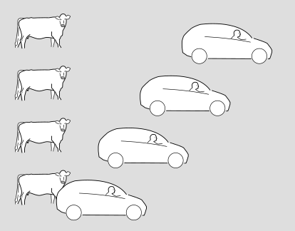
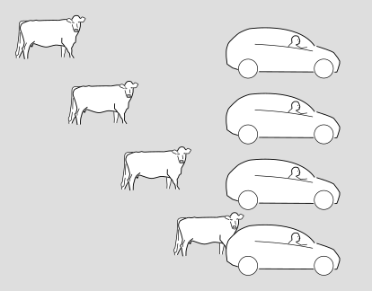
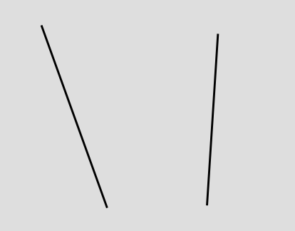
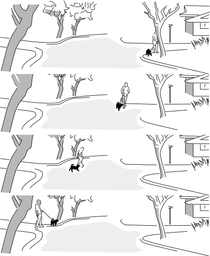

Do we all move through spacetime at the speed of light?
===================================================

You may have heard that according to Einstein's theory of relativity, we all move through spacetime at the speed of light.
Is this true?

Short answer: no.

The rest of this blog post is the long answer. The basic issue is that this characterization has been promoted by popularizers
using loose metaphorical language to try to describe math and physics. They write down some equations and some words, and
they intend you to understand the equations and just use the words as a way to make the medicine go down more smoothly.
But once these verbal misstatements emerge into the wild, they acquire lives of their own, unmoored from what they were
supposed to represent.
It just goes to show that using English to describe math is like using watercolors to describe a symphony. Fidelity and precision suffer.

*A painting that actually was intended to depict a musical form, at least according to the title. Kupka, "fugue en deux couleurs," 1912.*

This idea of "moving through spacetime at c" seems to be something originally perpetrated by the popularizer Brian Greene. To understand
what this would really mean, and why it's at best half-wrong, consider this diagram.

It's a series of snapshots in the a car and a cow.
Time moves forward as we go up the page. (If we had wanted to, we could have interchanged
the axes or reversed either or both of them. Making the time axis vertical, and
making the top point toward the future, is a standard convention in relativity,
like the conventional orientation of the compass directions on a map.)
The cow sees itself as being at rest,
while the car drives by on the road.

The following, alternative version shows the same situation in
the frame of reference of the driver,
who considers herself to be at rest while the scenery rolls by.

In relativity, we abstract out some of the artistic details and make a more pared-down
version of these diagrams, which looks like this.

We just show the motion of each object as a line or a curve. Depending on what frame of
reference we arbitrarily choose for the diagram, we can make one line or the other be
vertical (showing the object at rest), or we can make both of them slant. It doesn't
matter which frame of reference we choose. All we can really say in an absolute sense
is that the the one thing *is* moving -- relative to the other. That's why it's called
relativity.

The lines are called "world-lines." The somewhat odd terminology comes from an awkward
translation of a German phrase that was intended to be something more like "line through
the world," i.e., a line through spacetime.

The gray rectangle is referred to as "spacetime." It's a sort of stage, or a piece of graph
paper, that represents both time (vertical) and space (horizontal). If we take the picture and
fill it back in with trees and houses and atoms and religious bigots, it tends to evoke
a subjective view known as the "block universe" or "eternalism." (But there is no block universe
"theory." It's not a scientific theory that makes predictions about experiments, it's just a
mode of thought or description, and it isn't true or false.)

*(Figure by the author and his dog.)*

By the way, absolutely *nothing* I've said so far has anything to do with Einstein's theory of relativity.
All of this could have been written before Einstein was born, as a description of the kind of relativity
originated by Galileo.

So returning to our original question, do we all move through spacetime at the speed of light?
Well, objects don't move through spacetime. Objects move through space. If you depict an object in spacetime, you have a world-line. The world-line doesn't move through spacetime, it simply extends across spacetime. It doesn't move. It is.

Greene's portrayal of this seems to come from his feeling that because the magnitude of a massive particle's velocity four-vector is traditionally normalized to have magnitude c, it makes sense to describe the particle, to a nonmathematical audience, as "moving through spacetime" at c. This is simply inaccurate. A good way to see that it's inaccurate is to note that a ray of light doesn't even have a four-vector that can be normalized in this way. Any tangent vector to the world-line of a ray of light has a magnitude of zero, so you can't scale it up or down to make it have a magnitude of c. For consistency, Greene would presumably have to say that a ray of light "moves through spacetime" at a speed of zero, which is obviously pretty silly.

More recently, with people increasingly getting their pop-sci information from videos rather than the printed word, a lot of people seem to be influenced instead by a different and equally ill-considered popularization in a seven-minute video by Sabine Hossenfelder. Her English-language description contradict's Greene's, even though they both certainly understand the physics. 

Hossenfelder presents the following equation: Δs/Δt = sqrt[-(Δx/Δt)^2+c^2]. (I'm omitting the y and z dimensions for simplicity.) She interprets s as a sort of "spacetime distance." She can call it that if she wants to, but there's a good reason that this is not standard terminology, because it's a very poor fit to what the equation represents.

For example, suppose that an alien on the other side of our galaxy creates a beautiful work of art today ("today" meaning simultaneity in the frame of reference of our galaxy). Then Δt is at most a matter of hours, while Δx is thousands of light-years. If you plug in the numbers, you find that the right-hand side of the equation is the square root of a negative number. So it's really a swindle to call s "spacetime distance," which makes it sound like a generalization of the ordinary notion of distance. That's not what it is at all. What s really gives is a measure of the amount of time elapsed on a clock that travels a distance Δx in time Δt (divided by an arbitrary factor of 1/c, which only changes the numerical value, not the interpretation).
So in the alien art example, there is now a clear reason why the equation is inapplicable: a clock can't get there in time for the art premiere, but that would require traveling faster than the speed of light.

To see that Greene and Hossenfelder are not saying the same thing, consider the case where a clock is in motion relative to you. Greene says that the clock "moves through spacetime" at precisely c. Hossenfelder says that the clock "moves" at less than c. (She is careful to explain that the result Δs/Δt=c applies only "relative to yourself," i.e., in a frame of reference where you're at rest.)

Since both Hossenfelder and Greene are both describing a symphony using watercolors, it's not possible to say whether the watercolor picture is literally right or wrong. However, physicists do talk to each other about physics using words, and we usually understand each other pretty well. That's partly because we agree on standard ways of using esoteric terminology like "quark" and "strangeness." So it's worth noting that when Greene says "moving through spacetime" and Hossenfelder refers to "spacetime distance," these are not pieces of terminology that professionals ever use with each other. In the case of Hossenfelder's "spacetime distance," the thing that we actually attach a standard technical phrase to is not the square root she defines but actually the quantity inside the square root, which is called the "spacetime interval," I. It's not hard to understand why the standard terminology became standard -- because it refers to something that is always a real number, and the phrase avoids making it sound like it's more closely analogous to distance than it actually is.

[Ben Crowell](http://lightandmatter.com/area4author.html), 2022 Dec. 18

[other blog posts](https://bcrowell.github.io/)

This post is CC-BY-SA licensed.

