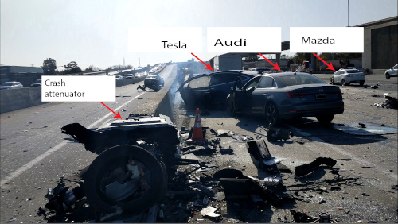

Psychopathic AI: a call to arms
==================

Our society has reached a tipping point with artificial intelligence. 
The harm is skyrocketing, and the claimed benefits are mostly snake oil.
I'm not normally a big fan of government regulation, but it's necessary here.

*Accident scene caused by a Tesla on autopilot, Mountain View, 2018.*

The psychopathic poster child of this historical moment is Elon Musk.
He's fraudulently and [illegally](https://cleantechnica.com/2022/12/29/california-bans-deceptive-self-driving-claims/)
marketed a $15,000 feature that falsely claims to add "full self-driving" to a Tesla.
In a [2019 crash](https://www.latimes.com/california/story/2022-01-19/a-tesla-on-autopilot-killed-two-people-in-gardena-is-the-driver-guilty-of-manslaughter), a Tesla on autopilot barreled down a freeway off-ramp, ran a red light, and killed two people in a Honda.
The car's owner is being tried for manslaughter, but the real criminal is Musk, who has
told drivers that they can take their hands off the wheel and stop paying attention.
In 2021, Tesla [stopped releasing data from accidents](https://cleantechnica.com/2022/12/29/california-bans-deceptive-self-driving-claims/)
caused by their system, which is a beta test being conducted on human guinea pigs.
There are other systems using better sensors that are [much more reliable](https://www.theverge.com/2019/4/24/18512580/elon-musk-tesla-driverless-cars-lidar-simulation-waymo), 
but Musk doesn't want to use them, because they take [about $500](https://futurism.com/the-byte/500-lidar-system-prove-elon-musk-wrong)
off of his bottom line. It's a race to the bottom, and Tesla plans to win.

Musk is also one of the founders of [OpenAI](https://en.wikipedia.org/wiki/OpenAI), which makes
the chatbot [ChatGPT](https://en.wikipedia.org/wiki/ChatGPT) and the art pastiche system
[DALL-E](https://en.wikipedia.org/wiki/DALL-E). Continuing the same snake oil pattern,
OpenAI encourages naive people to believe that these systems are both smarter and more
reliable than they are. Both of these systems also have the potential for serious social harm.

Many people using ChatGPT don't realize that it basically produces fluent nonsense. 
But as with the Tesla autopilot system, users are fooled by the system's behavior to think it works better than it does.
At least the autopilot is *usually* accurate. ChatGPT simply doesn't care.
A librarian
[writes](https://blacktwitter.io/@bibliotecaria/109650353375080864):

> Been seeing a lot about #ChatGPT lately and got my first question at the library this week from someone who was looking for a book that the bot had recommended. They couldn't find it in our catalog. Turns out that ALL the books that ChatGPT had recommended for their topic were non-existent. Just real authors and fake titles cobbled together. And apparently this is known behavior.

Many users seem to believe that the system is just in its early stages and will get more truthful
in the future, but AI expert Gary Marcus [says](https://www.nytimes.com/2023/01/06/podcasts/transcript-ezra-klein-interviews-gary-marcus.html) that the technique it uses is one where
with further training it becomes "more fluent but no more trustworthy."

An even bigger problem is that you don't necessarily know when you're interacting with
ChatGPT. A philosophy professor at Furman was mystified at first when he read a [take-home
exam paper generated by ChatGPT](https://www.dailymail.co.uk/sciencetech/article-11577317/Student-caught-using-ChatGPT-write-philosophy-essay-South-Carolina-university.html). At first he just [noticed](https://www.pbs.org/newshour/show/educators-worry-about-students-using-artificial-intelligence-to-cheat)
that "...it was beautifully written. Well, beautifully for a college take home exam, anyway."
[But](https://www.dailymail.co.uk/sciencetech/article-11577317/Student-caught-using-ChatGPT-write-philosophy-essay-South-Carolina-university.html) "despite the syntactic coherence ..., it made no sense." Personally, when I run into people online who
seem to be spouting nonsense about science, I now feel like I should probably cut and paste
their text into OpenAI's [https://openai-openai-detector.hf.space/](application) that is supposed to
detect whether it produced it. 

This is clearly unsustainable. The problem is that human beings have limited time available
for these games, but the machines never get tired. Programming Q&A site StackExchange has been
forced into a [battle](https://meta.stackoverflow.com/questions/421831/temporary-policy-chatgpt-is-banned) against wrong but well-written ChatGPT answers:
"[The] volume of these answers (thousands) and the fact that the answers often require a detailed read by someone with at least some subject matter expertise in order to determine that the answer is actually bad has effectively swamped our volunteer-based quality curation infrastructure."

Even worse is the capacity for what's known as [coordinated inauthentic behavior](https://www.nytimes.com/2023/01/15/opinion/ai-chatgpt-lobbying-democracy.html). Imagine a congressional representative on the receiving end of a letter-writing
campaign in which all the letters actually came from an AI.
    

[Ben Crowell](http://lightandmatter.com/area4author.html), 2023 Jan. 16

[other blog posts](https://bcrowell.github.io/)

This post is CC-BY-ND licensed.

Photo credits
-------------

Tesla crash scene - NTSB, public domain - https://en.wikipedia.org/wiki/File:Mtn_view_tesla_scene_graphic_(28773524958).jpg
