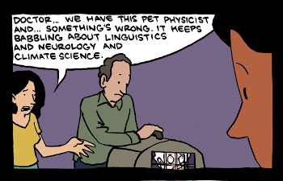

The junk science of quantum consciousness
=========================================

A weird phenomenon in the physical sciences is when the aging lions of the field
veer into areas outside their competence and start making silly claims.
Saturday Morning Breakfast Cereal has an [awesome comic strip](https://www.smbc-comics.com/index.php?db=comics&id=2556)
about it.

Linus Pauling [convinced people that megadoses of vitamin C cured the
common cold](https://www.vox.com/2015/1/15/7547741/vitamin-c-myth-pauling).
Equally silly is the [quantum woo](https://en.wikipedia.org/wiki/Quantum_mysticism)
of brilliant physicist [Roger Penrose](https://en.wikipedia.org/wiki/Roger_Penrose),
who believes that mysterious quantum processes underly the phenomenon of consciousness.

The theory has been through a series of incarnations. First Penrose suggested that
tiny structures inside neurons, called [microtubules](https://en.wikipedia.org/wiki/Microtubule),
actually acted as qubits. A [qubit](https://en.wikipedia.org/wiki/Qubit) is a type of
quantum-mechanical unit of information, the quantum analog of a bit. It can exist simultaneously in both of the
0 and 1 states, like Schrodinger's cat. It also has a quantum-mechanical property called phase, which in
a classical metaphor you can visualize as the wobbling of a spinning top. In a
[quantum computer](https://en.wikipedia.org/wiki/Quantum_computing), a network of
qubits have their phases tied together in a complicated network of long-distance interconnections.

These phase correlations are extraordinarily delicate.
Real-world quantum computers, which are still very primitive, are fussy high-tech systems that have to be
cooled down to cryogenic temperatures. So it's inherently extremely implausible that an object as
warm, wet, and messy as the human brain could be a quantum computer. Nor is there any good argument
to support Penrose's claim that consciousness can't happen without some kind of quantum fairy dust
to make it go.

Penrose's idea was immediately refuted. For example, physicist Max Tegmark estimated that the
quantum correlations in objects the size of microtubules were so delicate that they would be destroyed within 10^-13 seconds --
about a billionth of the shortest time-scales involved in signal processing by the nervous system.
As often happens with this kind of gee-whiz pseudoscience, Pensose responded by
elaborating his ideas, without admitting that they were fundamentally implausible and unnecessary
for explaining consciousness. He calls his latest rebranding of the idea "Orch OR."

As objects get bigger, it gets more and more difficult to make them exhibit quantum correlations for
any amount of time before they get scrambled. That was why Penrose initially proposed the microtubules
inside neurons -- he was looking for the most microscopic anatomical features he could think of.
Since estimates like Tegmark's show that that's impossible, more recent proposals, by people like
UCSB physicist Matthew Fisher, have focused on even smaller objects, molecules called
[Posner clusters](https://en.wikipedia.org/wiki/Amorphous_calcium_phosphate#Posner's_clusters).
Studies by Litt et al. and Koch and Hepp, and McKemmish et al. have pointed out multiple independent reasons
why the concept just doesn't work in general.

The whole sad story reminds me of the notion that radio waves could cause cancer, which started in the
days before cell phones and never made any sense in terms of the fundamental physics: radio waves
are too low in frequency to be able to ionize atoms, so when they interact with your body, all they
can do is heat you. But my generation was nevertheless told not to sit too close to the TV or, later,
stand too close to the microwave, because we would get cancer. Biologists and epidemiologists spent
decades on quixotic attempts to use biology to probe this question that was really a non-starter at the basic
physical level. Only when cell phones came along did this junk science start to peter out, since
nobody wanted to imagine that the phone they were holding against their head could be giving them
brain cancer -- but there are still kooks in my neighborhood who believe that our high school's
5G network is an evil health hazard.

Along the same lines, people are spending grant money these days on things like NMR studies to see
whether quantum correlations could be more robust than expected if they're partially shielded
by their molecular environment (Kerskens and López Pérez, 2022). There are simply too many different
reasons why the notion of the human brain as a quantum computer is physically implausible.

[Ben Crowell](http://lightandmatter.com/area4author.html), 2022 Nov. 29

References
----------

Christian Matthias Kerskens and David López Pérez 2022 J. Phys. Commun. 6 105001 DOI 10.1088/2399-6528/ac94be
https://iopscience.iop.org/article/10.1088/2399-6528/ac94be

Koch, C., & Hepp, K. (2006). Quantum mechanics in the brain. Nature, 440(7084), 611–611. doi:10.1038/440611a
https://sci-hub.se/10.1038/440611a

Litt et al., 2006, Is the Brain a Quantum Computer?, https://sci-hub.se/https://doi.org/10.1207/s15516709cog0000_59~

McKemmish et al., 2009, Penrose-Hameroff orchestrated objective-reduction proposal for human consciousness is not biologically feasible
https://sci-hub.se/https://doi.org/10.1103/PhysRevE.80.021912

Tegmark, M. (2000). Importance of quantum decoherence in brain processes. Physical Review E, 61(4), 4194–4206. doi:10.1103/physreve.61.4194, https://sci-hub.se/10.1103/PhysRevE.61.4194

