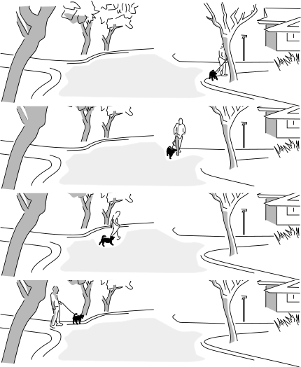

Spacetime diagrams and the relative nature of time
==================

This blog post is an introduction to spacetime diagrams, which are a really cool way to understand
what's going on in Einstein's theory of special relativity. As an application, I'll include some
examples what it means to say that time is relative.

Here's our first spacetime diagram:

It's a series of snapshots of a car and a cow.
Time moves forward as we go up the page.
The cow sees itself as being at rest,
while the car drives by on the road.

The following, alternative version shows the same situation in
the frame of reference of the driver,
who considers herself to be at rest while the scenery rolls by.

In relativity, we usually abstract out some of the artistic details and make a more pared-down
version of these diagrams, which looks like this.

We just show the motion of each object as a line or a curve. Depending on what frame of
reference we arbitrarily choose for the diagram, we can make one line or the other be
vertical (showing the object at rest), or we can make both of them slant. It doesn't
matter which frame of reference we choose. All we can really say in an absolute sense
is that each thing *is* moving -- relative to the other. That's why it's called
relativity.

The lines are called "world-lines." The somewhat odd terminology comes from an awkward
translation of a German phrase that was intended to be something more like "line through
the world," or "line through all of history and existence."

The gray rectangle is referred to as "spacetime." It's a sort of stage, or a piece of graph
paper, that represents both time (vertically) and space (horizontally).
Any point on the rectangle represents a where-and-when, such as the battle of Gettysburg.
We refer to such a point as an "event," even if nothing special actually happened there.

If you've taken
a physics class in high school or college, you've probably heard of vectors in three-dimensional
space. In relativity, when we say "vector" we mean a vector in spacetime, which has "3+1 dimensions,"
i.e., three dimensions of space and one dimension of time.
In order to depict things on a page or screen, we usually omit two of the space dimensions, which makes
it a depiction in 1+1 dimensions. As shown in the figure below, one way of defining a vector is to single out a certain piece of
a world-line, with a definite start and end, and an arrowhead that gives it a direction. This
type of vector is called a spacetime displacement vector. Often we want to use this kind of
vector to describe the fact that an object moved in a certain way so that it existed at a certain
event and later existed at some other event.

If we take the picture and
fill it back in (below) with trees and houses and atoms and religious bigots, it tends to evoke
a subjective view known as the "block universe" or "eternalism." (But there is no block universe
"theory." It's not a scientific theory that makes predictions about experiments, it's just a
mode of thought or description, and it isn't true or false.)

*(Figure by the author and his dog.)*

"Same place" is undefined.
--------------------------

The cow's frame and the driver's are equally valid, and one consequence of this is that
they don't have to agree on whether two events occur in the same place, i.e., whether
or not a particular displacement vector tilts or not. If I visit the Gettysburg battlefield
and look at the brass plaque, it's a matter of opinion whether or not I'm actually at the
same place where the battle happened. It's the same place if I use a frame of reference
attached to the dirt, but from the point of view of an alien on another planet, the earth
has been spinning and orbiting the sun, which puts the dirt in a different place after a
century and a half.

By the way, absolutely *nothing* I've said so far has anything to do with Einstein's theory of relativity.
All of this could have been written before Einstein was born, as a description of the kind of relativity
originated by Galileo.

Relativity of time
------------------
The decisive break between Newton and Einstein comes when we consider time.
Newton claimed:

"Absolute, true, and mathematical time, of itself, and from its own nature, flows at a constant rate without regard to anything external..."

There are actually two different claims being made here. First, Newton is saying that there is some sort of pure or
abstract time that exists regardless of clocks -- clocks being imperfect and limited in precision. This is sort of
a philosophical claim rather than a scientific one, and in any case most people these days don't endorse Newton's
take on this. A more common philosophical stance is [operationalism](https://en.wikipedia.org/wiki/Operational_definition),
according to which a term like "time" does ultimately have to be defined according to the operations required in order to measure it.
Otherwise it's not really clear how we could get started defining what "time" is. However, we do abstract away any special limitations
or quirks of specific clocks. If we see *all* clocks behaving in a certain way (with any differences being consistent with their
known limitations), then we say that what we're seeing is a behavior of time itself.

The second claim Newton is making is that nothing can influence the rate at which time flows. This is a scientific
claim, not just a philosophical preference, because it can be tested by experiments. When we test it, we find that it's false.
The evidence was indirect when Einstein first published his theory of relativity in 1905, but
eventually technology became good enough to allow conceptually *simple* experiments
that students in the early 20th century could only discuss in terms like "Imagine that we could..."
A good jumping-on point is 1971. In that year, J.C. Hafele and R.E. Keating
brought atomic clocks aboard commercial
airliners, and went around the world, once from east to west and once from west to east.
They observed that there was a discrepancy between the times measured by the
traveling clocks and the times measured by similar clocks that stayed home at the U.S. Naval Observatory in Washington.
The east-going clock lost time, ending up off by -59±10 nanoseconds, while the west-going one gained 273±7 ns.

*The clock took up two seats, and two tickets were bought for it under the name of "Mr. Clock." (Copyright 1971, Associated press. Used under U.S. fair use exception to copyright law.)*

Newton's notion of absolute time seems like common sense, but in fact it's only an approximation.
For a passenger jet, it's quite a good approximation, and we need fancy atomic clocks to detect the
discrepancy. For a subatomic particle in a particle accelerator, or the bits and pieces moving around violently
inside the atomic nuclei in your body, it can be a really bad approximation. When a clock moves smoothly
through spacetime, so that its motion can be represented as an arrow without any curves or kinks, it records
a certain amount of time. When a clock takes a more circuitous route from A to B, like the clocks aboard the
plane, it records a different amount of time, which is always *less* than the time taken by the non-swervy clock.

Because these effects occur regardless of the type of clock, and always obey the same rules,
we consider them to be facts about time itself,
and we say that time is not absolute. If time isn't absolute, then neither is simultaneity. Just as Newton and
Galileo showed that "same place" depends on one's frame of reference, Einstein showed the lack of any universal
notion of "same time." If two observers are in motion relative to one another, they will in general disagree
both about whether events occur at the same place and about whether they occur at the same time.

Proper time
----------------------------

The experiments show that if a clock moves smoothly through spacetime, then the time elapsed on the clock
depends only on the displacement vector, and not on anything else. This gives us a way of defining a measurement
of the "length" of the vector. 

But watch out, because these "lengths" don't have to behave in all the same
ways as lengths of arrows on a piece of paper. The figure below is a simplified spacetime diagram of the Hafele-Keating
experiment, with the plane simply traveling straight away from home base and then coming back at the same speed.

If you thought that ruler distances on paper were valid indications of clock time, then you would expect the
traveling clock to record more time than the home-base one. But remember, it's always the clock that *doesn't*
undergo anything but smooth motion that experiences the most time. That is, it's the other way around compared
to what you'd think from the lengths on the page. If it helps your intuition, you can
think of the line segments as roads, and the clock times as indications of how many gas stations
you pass on those roads. In this particular diagram, the longer road just happens to have fewer gas stations.
In this blog post, I'll present just enough information about the rules for "how many gas stations" there are in order
to make a logically rigorous framework for getting at my main topic, which is why relativity forbids faster-than-light motion.

[Ben Crowell](http://lightandmatter.com/area4author.html), 2023 Jan. 3

[other blog posts](https://bcrowell.github.io/)

This post is CC-BY-SA licensed.

