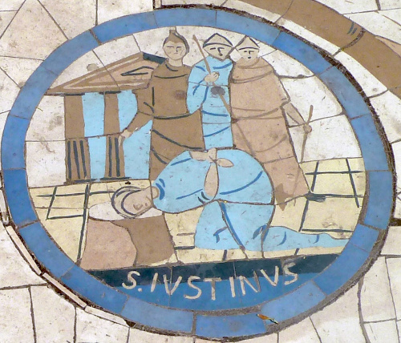
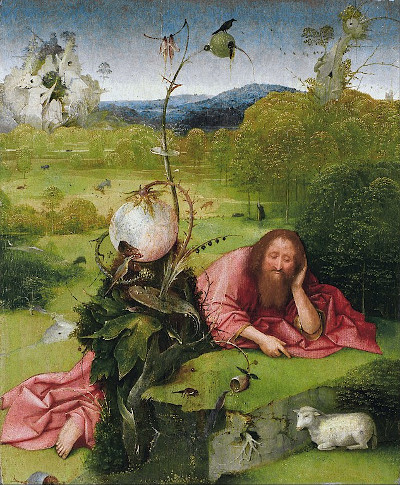
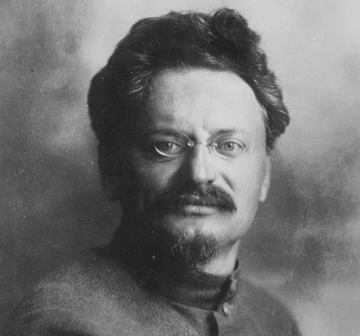
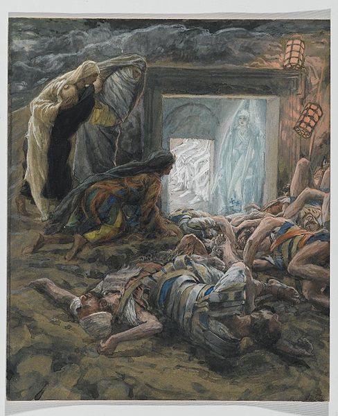
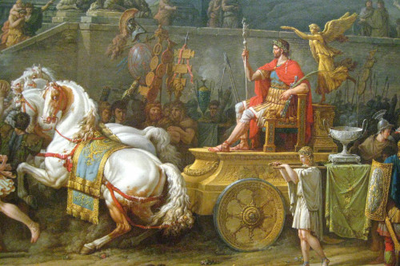
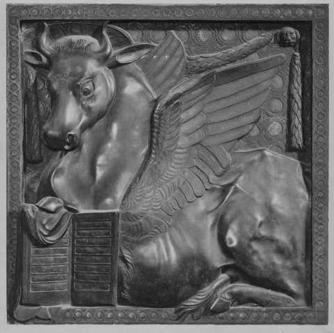

The who, when, and where of early Christianity
==================

How little is known, and why it matters
---------------------------------------

In 1840, aliens landed in Iowa on the banks of the Cedar River and had
a series of enigmatic interactions with humans, spending only a short
time on our planet before suddenly and inexplicably leaving without a trace. The
people who met them were not literate white males, so it wasn't until
after the Civil War that anybody tried to write down a systematic account.

*The beheading of Justin Martyr, who gave us our first dated snapshot of the evolution of the Christian gospels, more than a century after the crucifixion.*

This is of course a fictional story, but it's a lot like the
historical puzzle of early Christianity. Newspaper reporters are
taught to nail down the who-what-where-when in the first paragraph. We
have very little of that for the period when the contours of the new
religion were being laid out, and it's the whens in particular that
are hard to pin down. The gospels (of which four were eventually chosen
to be canonical) are central to this story, but we don't have a single
firm date for any portion or version of them until about 155-157, which is when 
[Justin Martyr](https://en.wikipedia.org/wiki/Justin_Martyr) gives us our
first peek. That's a gap of well over a century.

The history matters if you care about how western civilization, for better or
for worse, had its collective brain molded. Were Christians persecuted, or
is that a myth? How much of Christianity is really the invention of the Apostle
Paul ("[Paulianity](https://en.wikipedia.org/wiki/Pauline_Christianity)"), and how much is due to people you've probably never heard
of, like Marcion of Sinope?
Can Paul's homophobia be surgically removed from the religion?
The Gospel of Mark presents Jesus's life with almost no mention of any
novel ethical teachings.[^novel_ethics] Did those ideas only later come to be associated with him?

The whos
--------

Probably the easiest of the "W's" is the whos.

The Gospel of Mark is likely the first written biographical material about Jesus, but
it begins not with a description of Jesus but of John the Baptist.
John was a great celebrity of his time and place. He merits a long passage in
[Josephus](https://en.wikipedia.org/wiki/Josephus)
-- much longer than the brief mention of Jesus.[^josephus_on_jesus] A pagan author like Epictetus, writing as late as
ca. 130 CE, demonstrates a clear consciousness of a baptism-based sect such as John's,
but no consciousness of Jesus or his sub-sect. During the first century CE, it's probably
most accurate to talk about something like a John-Jesus sect of Jews rather than any
exclusivist or distinctly recognized religion based on Jesus.

*John the Baptist was a bigger deal than Jesus.*

If anything, it was John who was more of a big deal to their contemporaries. Josephus, writing around 90 CE, says:

> Now some of the Jews thought that the destruction of Herod's army [ca. 36 CE, by the Nabateans] came
> from God, and that very justly, as a punishment of what he did against
> John, that was called the Baptist: for Herod slew him, who was a good
> man, and commanded the Jews to exercise virtue, both as to
> righteousness towards one another, and piety towards God, and so to
> come to baptism [...]

If Jesus had been more prominent, then it wouldn't have made much sense for people at the time to have
attributed these events to John's execution rather than Jesus's.

For the early leadership team, most
of us would think first of the apostles, but the existence of such a designated
group of twelve ([or 70](https://en.wikipedia.org/wiki/Seventy_disciples)) is unlikely to be historical, because
they don't line up at all with what we know from other sources about the movement's leadership.
Josephus mentions Jesus, John the Baptist, and Jesus's brother James, but none of the Twelve.
Peter is certain to have existed, since he is recorded as getting into very plausible
controversies with Paul. Included with Peter in these controversies were two other Jews, John the apostle and James the brother
of Jesus (not either of the apostles named James). These three are described by Paul as forming a core leadership
group (Gal 2:9). But Paul's extensive writings never mention the twelve except in one spot (1 Cor 15:5)
which is in the context of a creed. Because Paul deals so extensively with the real-world mechanics of
the early movement's politics and organization, it's impossible that he would omit any other mention
of the twelve if such a group was historical. When Paul does discuss which leaders were at a fifteen-day meeting in Jerusalem
(Galatians 1:18), the list is again the historically attested core group (himself, Peter, and James the brother of
Jesus).[^acts_on_twelve]

The four canonical gospels are all anonymous works.[^gospels_authorship]

*Like Trotsky, Paul had to be rehabilitated.*

Paul was the first of the prominent leaders of the Jesus movement to
be literate (Jesus probably wasn't[^jesus_literacy]), so we have a
fairly full picture of his life, including approximate dates. What is
odd is that we have no clear explanation for why, if Paulinism was
early, widespread, and popular, there is no more explicit or literal
record of Paul's wider influence for a century afterward.  Equally
mysterious is his later rehabilitation, a la Leon Trotsky. The record
is so sketchy that it's sort of like knowing that Trotsky was murdered
in Mexico City using an ice ax, but not knowing whether the killer was
FDR or Greta Garbo. All we get is an ultra-fragmented, distanced view
of some kind of inside-baseball sectarian conflict.

Where
-----

The wheres are a lot sketchier. We know all about the geography of Paulinism, because Paul's writings tell us about that. Everything
else is more of a haze. The canonical gospels were all written in Greek. Mark, the earliest, is especially important. Where was it written, and for what audience?

Many Christian authors have wanted to believe [Papias of Hierapolis](https://en.wikipedia.org/wiki/Papias_of_Hierapolis#Gospel_origins)'s
account, that Mark was actually written by someone named Mark, who was Peter's interpreter. This would place its composition in Rome.
For anyone who doesn't believe in supernaturalism, this is all impossible, since Mark would then date to before the destruction of
the [Second Temple](https://en.wikipedia.org/wiki/Second_Temple), but the author clearly knows that the temple has been destroyed.
The desire is clearly to connect the gospels to the life of the historical Jesus by the shortest possible chain of personal links.
Other authors think rural Syria is a more likely place of origin.[^mark_syria]

More likely Mark is a composite document that grew over a long period of time and in a variety of places.
At least some of the audience was Italian, since it has lots of Latinisms and explains things by reference to Roman society.
Some were gentile, since it explains basic things like kosher rules and the Aramaic word "abba" (father).

But at the some time, there are clearly some features that are aimed at Jews. The rending of the temple's veil
(15:38) comes at a climactic moment, but a gentile audience would be unlikely to get the intended emotional impact
of this miracle, even if the veil was famous. There is none of the antisemitism of Luke and John. Aramaic words
are often preserved, which seems like an unlikely thing for a Greek-speaking author to bother doing when
writing for a Greek-speaking, gentile audience. But at the same time, these Aramaisms are translated so that
that portion of the audience will understand them.

When
----

The whens are the toughest of all -- not that you would know it from many presentations. For example,
Wikipedia currently [claims](https://en.wikipedia.org/wiki/Dating_the_Bible#Table_IV:_New_Testament) to be able
to place Mark at 65-73 CE, which is an absurd confidence interval when we're dealing with a piece of writing for which there are
[no copies earlier than the third century](https://en.wikipedia.org/wiki/Papyrus_45). There is a cult
of [false precision](https://en.wikipedia.org/wiki/False_precision), as in the following classic Star Trek dialog:

> Kirk: What would you say the odds are on our getting out of here?

> Spock: Difficult to be precise, Captain. I should say approximately 7,824.7 to 1.

When it comes to the gospels, this tendency towards false precision goes back to the same credulity and pietism that
led people to uncritically accept Papias. For every modern expert who gives a reasonable range of error, there
is some older or more conservative authority who confidently asserts some very narrow range of dates. They want
the range to be narrow so that they can make it *early* and narrow, all with the goal of
giving their religion the most direct possible connection to the poorly recorded man named Jesus of Nazareth.

There is actually no reason to believe that a text like Mark was even composed
on  a single well-defined date or in one place.
The evidence points the opposite way. For example, the 
final chapter of Mark is witnessed in [several different forms](https://en.wikipedia.org/wiki/Mark_16).
The original version ends in an ambiguous and confusing incident, in which three of Jesus's female followers
enter his tomb, encounter a mysterious man in white who tells them Jesus is risen, but then never
tell anyone else. That version didn't work well, probably both because Jesus himself failed to appear and
because the witnesses were female. (Women weren't considered valid witnesses in general.) Therefore two
other versions were written, of which one finally became canonical.

*The women at the tomb, and the mysterious man in white*

We also know that as late as 155-157, Justin Martyr was working from documents he calls the "memoirs of
the apostles." These seem to overlap a lot with what we would now call the canonical gospels, but he also
seems to have a lot of information that didn't make it into the canon, such as a story that Jesus was
born in a cave. This tells us that not only were the gospels being edited for centuries before their
wording became set, but that fairly significant aspects of them remained fluid for a long time.

From the point of view of someone who doesn't believe in the supernatural, there is further evidence.
We have supernatural stories such as [Herod's massacre of the innocents](https://en.wikipedia.org/wiki/Massacre_of_the_Innocents)
or the ones about the temple veil. As a typical example, the [mishnah](https://en.wikipedia.org/wiki/Mishnah) (Gittin 56)
says that after the fall of the Temple in 70, the Roman general Titus entered the temple's holy of holies, where gentiles
were supposed to be forbidden. He brought with him a prostitute and a torah scroll. He laid the scroll down on the
floor and had sex with the prostitute on top of it. Then he cut the veil with his sword, and a torrent of blood poured out, which
he thought was a sign that he had killed the God of the Jews.

Now miracles can be public public, private, or anything in between, and the public ones help with dating.
Something like Herod's massacre can't be hidden from the public. If you accept the supernatural hypothesis
that it actually happened, then it would have been famous. People in the area would have known about it, and would have
told their kids and grandkids. If you *don't* believe in the supernatural, then it works the other way around. People
in the area would have known that it *didn't* happen. If you asked them, they wouldn't be uncertain, any more than I
would be uncertain about whether Al Qaeda followed up 9/11 by destroying the Golden Gate Bridge. So any writings that
describe such a public miracle must have circulated only in a time and/or place very distant from the original, claimed event.

*The rending of the temple veil was made famous by the Flavian triumph.*

In the Christian version of the veil myth ([Mark 15:38](https://ebible.org/web/MRK15.htm)), the veil is rent from top to bottom
at the moment when Jesus gives up the ghost. (The other gospels add additional public miracles in the form of an earthquake
and the opening of the tombs.) The veil was in fact a very famous object of its time, so that there could
not have been any doubt initially (even among gentiles and as far away as Rome) that nothing like this miracle had taken place.[^veil_famous]
That means that at least this particular story in Mark must date to generations later than the Roman-Jewish war, probably 120 CE or later.
Otherwise it would never have been acceptable to its audience, especially in Syria-Palestine. Since other portions of Mark
have to date to as early as ca. 80 CE,[^early_mark] Mark has to have been composed over an extended period of time.

Because the timing of the gospels is so much more fuzzy compared to what was claimed in older
reverential treatments, there is room for much greater uncertainty in how they came to be written.
A very interesting hypothesis along these lines is presented by Tyson in his book
[Marcion and Luke-Acts: A Defining Struggle](https://www.bookfinder.com/search/?author=Tyson%2C+Joseph+B.&title=Marcion+and+Luke-Acts%3A+A+Defining+Struggle&lang=en&st=xl&ac=qr). According to this theory, which builds on previous work by Knox,
there was a local Gospel used in [Pontus](https://en.wikipedia.org/wiki/Pontus_(region))
which was the source for two different versions of the Gospel of Luke. One of these became
the one used by [Marcion of Sinope](https://en.wikipedia.org/wiki/Marcion_of_Sinope),
the most important early Christian who you've never heard of. Marcion was later denounced as
a heretic, which is why you don't hear about him any more often than you hear about
Trotsky. According to Tyson, it was *after* Marcion that somebody else bolted on the
birth and resurrection accounts and created what we now call the canonical gospel of
Luke.

*The gospel of Luke is traditionally said to have been written by a person named Luke, whose icon is an ox.*

The Knox-Tyson idea would have seemed inconceivable to workers who were laboring under the
misconception of false precision when it came to dating, because according to the standard
(falsely precise) chronology, Marcion was supposed to come *after* Luke. I don't know if I'm
completely convinced by Tyson's picture, but because of the vast uncertainty in the dates,
it's plausible and worth treating on an equal
footing with other accounts.

Thanks for reading!

[Ben Crowell](http://lightandmatter.com/area4author.html), 2023 Jan. 14

[other blog posts](https://bcrowell.github.io/)

This post is CC-BY-ND licensed.

Notes
-----

[^novel_ethics]: Almost all the novel ethical material in the gospels is in the [Sermon on the Mount](https://en.wikipedia.org/wiki/Sermon_on_the_Mount), which appears in the Gospel of Matthew, and also in a shorter version in Luke. This includes legalistic commandments (no lawsuits, no oaths), and emotional ones (peace, forgiveness, loving enemies, anger and lust as sins). Since Mark, which omits this, is earlier than Matthew and Luke, these teachings were either invented after Jesus's life or else reinserted after being mysteriously omitted from Mark.

[^josephus_on_jesus]: Antiquities of the Jews 20-9; excluding the likely forgery in 18-3

[^acts_on_twelve]: The Acts of the Apostles likewise focuses almost exclusively on Peter and Paul, mentioning the twelve only briefly. It's very telling that in a work with this title, there is essentially nothing that could be characterized as a historical representation of anything said or done by the twelve. (And Acts is in any case basically a work of historical fiction.) In Acts 1:11, an angel addresses the gathered twelve as ``you men of Galilee,'' which does line up with the likely historical reality that Jesus's most ardent followers during his own lifetime were all Galileans. The fact that there are no writings reliably attributed to any of the twelve also makes sense in terms of the historical reality that Jesus's followers would have been illiterate. (1 Peter and 2 Peter are pseudoepigraphical works by two different, later writers.)

[^gospels_authorship]: Re Luke and John, see the Wikipedia articles [Authorship of Luke–Acts](https://en.wikipedia.org/wiki/Authorship_of_Luke%E2%80%93Acts) and [Authorship of the Johannine works](https://en.wikipedia.org/wiki/Authorship_of_the_Johannine_works).

[^jesus_literacy]: Many experts believe that Jesus was unable to read.  Any opportunities to learn to read or write would have been extremely scarce, hence the disbelief expressed in Mark 6:2. The gospels say that Jesus did not have any formal opportunity to learn to read (John 7:15), and if this is true, then he could only have taught himself or learned informally from someone. (There were probably no institutions similar to our modern schools, and it's unclear whether Nazareth had a synagogue; if there was one, it probably didn't have a copy of the torah or other Hebrew scriptures.) From a straight reading of the gospels, we would get the impression that the adult Jesus had a deep knowledge of the scripture and was able to debate its fine points skillfully. But actually the passages in the gospels where he quotes scripture often show signs of being later layers added by Christian writers.

[^mark_syria]: For a summary, see Rohrbaugh, 1993, "The Social Location of the Marcan Audience," https://sci-hub.se/https://doi.org/10.1177/014610799302300304

[^veil_famous]: There is a variety of evidence that the temple veil was well known throughout the Roman empire, much like the Liberty Bell in North America today. After the Roman-Jewish war ended, such artifacts were brought to Rome and displayed by Flavius in a triumphal procession, including parade floats with simulated fires, and real prisoners being slaughtered in theatrical reenactments of battles. The clearest evidence we have that the veil itself was well known is that we can track how it was referred to over the years in writings intended for a variety of audiences. In Mark, which is carefully written to be understandable to gentile Romans among its audience, there is no explanation of what it is, even though other Jewish customs and concepts are explained in detail -- even very basic ones. Over the years, we see evidence that western audiences begin to forget what it is, so that writings such as the western witnesses of the Diatessaron need to explain it. Thus we can track very accurately how much ordinary people in the Roman empire knew about the veil and when they knew it.

[^early_mark]: There is a variety of evidence to this effect, but the most telling is that Mark 8:38-9:1 prepares Jesus's followers for the coming of the Son of Man "in the glory of his father surrounded by the holy messengers/angels," during the lifetimes of his listeners. If that particular section of the text had not become ossified fairly early on, then it would certainly have been framed in a different way so that it would not sound so much like a failed prophecy.

Photo credits
-------------

Justin Martyr - https://commons.wikimedia.org/wiki/File:Mosaic_of_St._Justin_Martyr,_Mount_of_the_Beatitudes.jpg

John the Baptist in the wilderness - Bosch

Trotsky - https://commons.wikimedia.org/wiki/File:%D0%9B%D0%B5%D0%B2_%D0%94%D0%B0%D0%B2%D0%B8%D0%B4%D0%BE%D0%B2%D0%B8%D1%87_%D0%A2%D1%80%D0%BE%D1%86%D0%BA%D0%B8%D0%B9.jpg

The women at the tomb, and the mysterious man in white - Tissot, https://upload.wikimedia.org/wikipedia/commons/thumb/c/ce/Brooklyn_Museum_-_Mary_Magdalene_and_the_Holy_Women_at_the_Tomb_%28Madeleine_et_les_saintes_femmes_au_tombeau%29_-_James_Tissot.jpg/488px-Brooklyn_Museum_-_Mary_Magdalene_and_the_Holy_Women_at_the_Tomb_%28Madeleine_et_les_saintes_femmes_au_tombeau%29_-_James_Tissot.jpg

Roman triumph - Vernet, 1789, https://commons.wikimedia.org/wiki/File:The_Triumph_of_Aemilius_Paulus_(detail).jpg

St Luke's ox - Donatello, https://it.wikipedia.org/wiki/File:Donatello,_simbolo_di_san_luca.jpg
